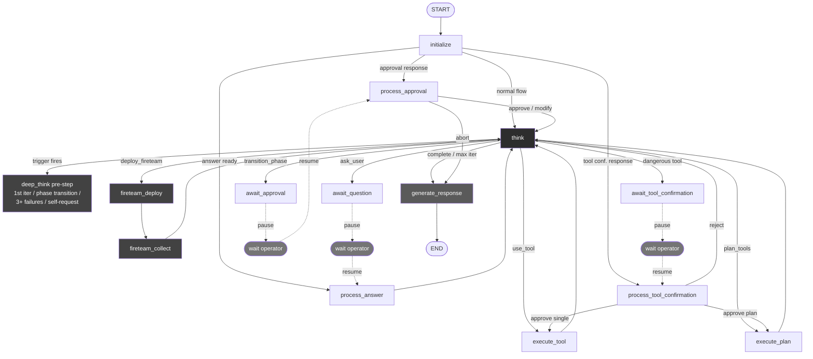
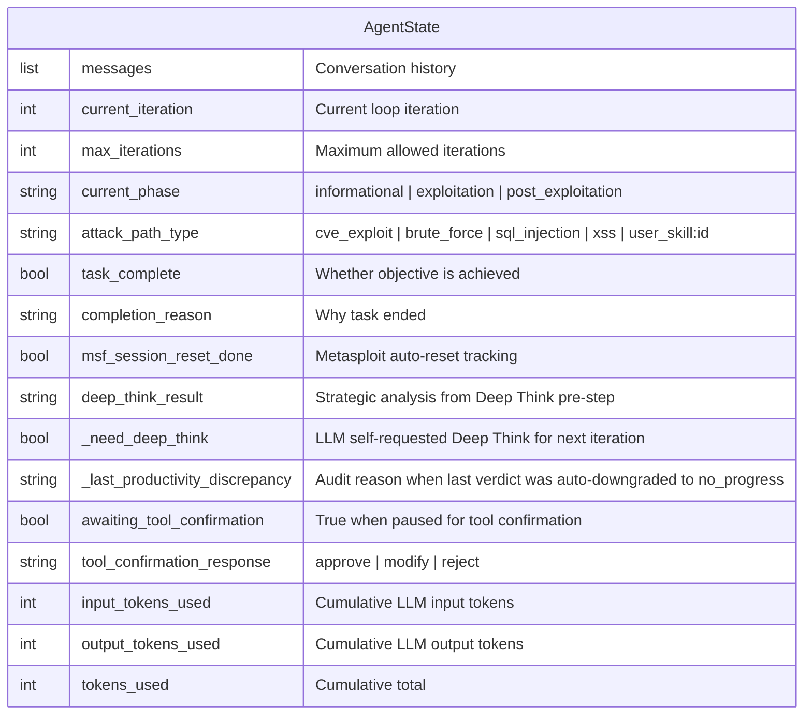
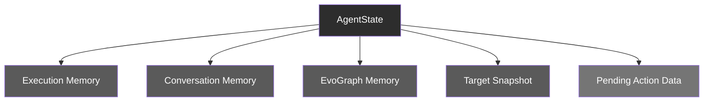
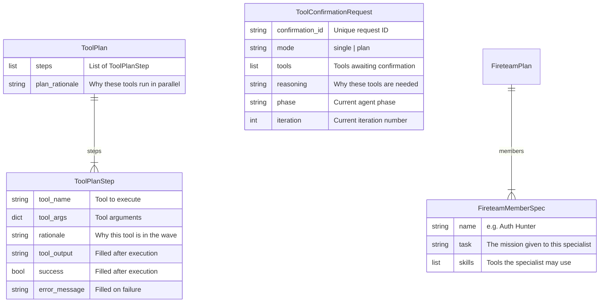
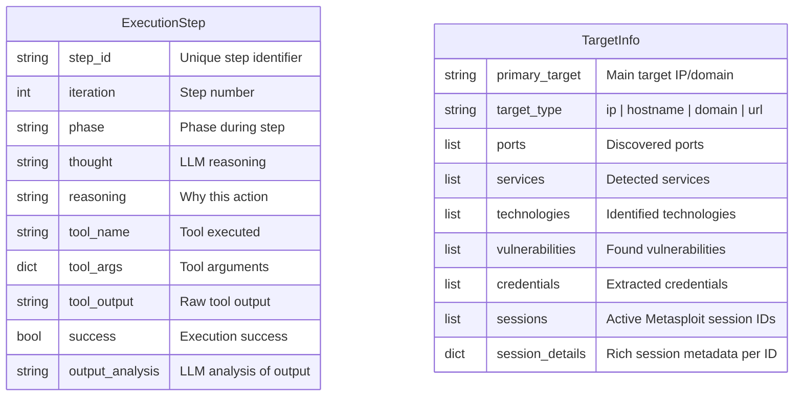
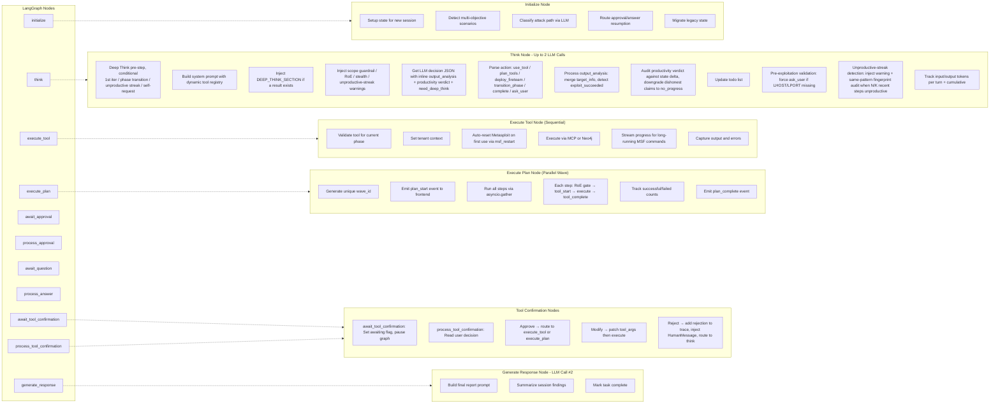
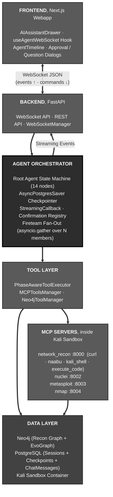
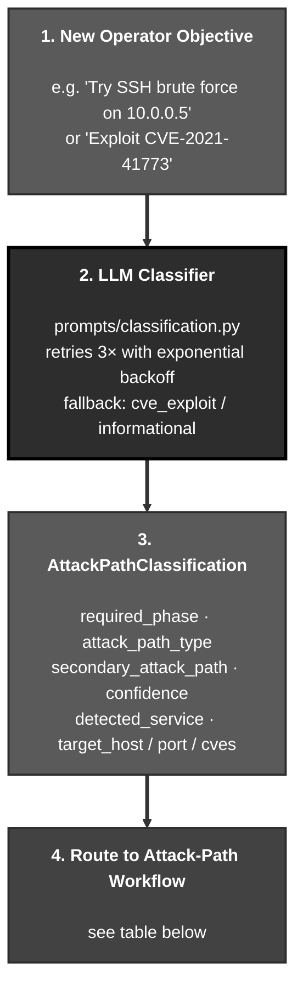
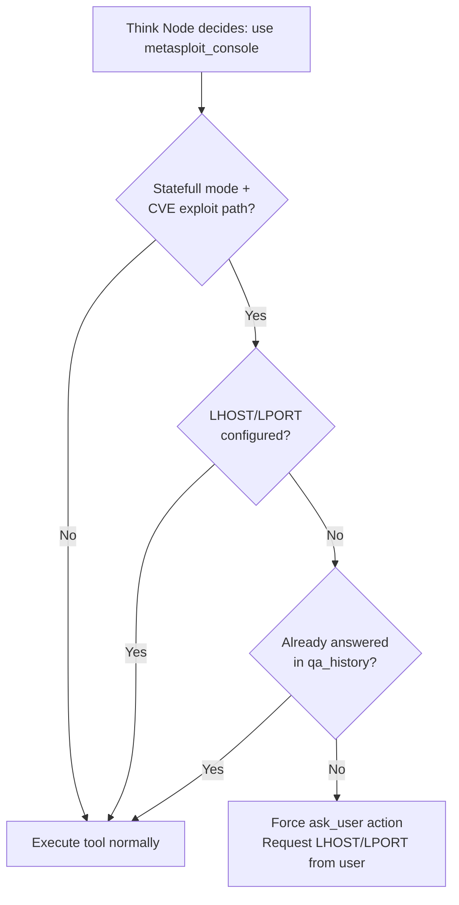

**版本 4.13.0** - 2026-05-27

# RedAmon Agentic System - Technical Whitepaper（技术白皮书）

## Executive Summary（执行摘要）

RedAmon 是一个由 AI 驱动的渗透测试平台，核心基于 **Scatter-Gather ReAct（SG-ReAct）**：一种将迭代式 ReAct 推理循环与“有界并行”的多智能体分解相结合的混合架构。根（root）智能体负责运行整个任务；当目标可以分解为彼此独立的调查角度时，它会部署一支由专家子智能体组成的 *fireteam（火力小队）*，这些子智能体在同一个事件循环中并发工作，并将各自发现汇总回传。该模式在不引入协作混乱的前提下提供按真实时间（wall-clock）的并行能力，同时具备可预测的终止性、可审计的安全性，以及在图中每个节点上都可实时由操作员掌控的控制能力。

RedAmon 的差异化不在于“让 LLM 在循环里跑”，因为 2026 年几乎每个 agentic 渗透测试器都这么做；真正的差异在于围绕循环构建的 *认知脚手架（cognitive scaffolding）*。系统在一些具有架构意义的时刻（首次迭代、阶段切换、分层的生产力评分阈值跨越、或智能体主动请求帮助）会触发一次 **Deep Think（深度思考）战略预步骤**，产出结构化的“情境 / 竞争性假设 / 方向向量 / 方法路径 / 优先级 / 风险”分析，用于锚定后续决策；该 schema 会 *强制* 战略层至少枚举 ≥2 个候选解释，并为每个解释给出一个可执行、可区分（disambiguating）的探针，这是一种对抗确认偏差的机制，把“一串猜测”变成“一个科学实验”。Deep Think 还带有 **冷却（cooldown）**（在智能体执行完上一份计划前抑制再次触发，并提供 critical 档与 state-growth 停滞等覆盖条件）以及 **Jaccard 新颖性检查（novelty check）**（当新计划只是对失败计划的复述/改写时予以拒绝，迫使智能体明确指出究竟改变了哪个具体参数，或转向此前计划中不存在的策略类别）。

系统通过 **连续型生产力评分（continuous productivity score）** 来检测“原地打转”的循环行为：它将五个可观测信号聚合为一个无量纲数值，并映射到五个档位（green → yellow → orange → red → critical），并触发逐级升级的提示层动作。最巧妙的输入之一是 **轴锁定检测器（axis lock-in detector）**：它按工具族（tool family）提取器将每次高成本调用压缩为智能体“保持不变”的语义维度，例如凭据爆破可表示为 `(target=/login, fixed_user=admin)`，目录枚举可表示为 `(target=/FUZZ, fixed_filter=200,301)`，并把这些记录到一次会话生命周期内的台账（ledger）中。即使三次对同一用户名的爆破使用了不同字典，也会折叠为同一个 axis key，因此分散在很多迭代里的慢循环仍会被识别为重复。对同一轴的第三次无效尝试会让评分跨过 red，编排器会明确点出“被锁死的旋钮”，要求智能体改变不同的参数，而不是在同一条失败路径上继续加码。再结合一个 **由编排器持有的 state-growth 信号**（当任务状态真实增长时重置为 0，否则递增，完全独立于 LLM 的自我报告），生产力层不会被过度乐观的智能体“骗过”。

任务执行本身运行在一个 **14 节点的 LangGraph 状态机** 上，每一步之后都会将状态持久化到 PostgreSQL 的 checkpoint，因此多小时的自主运行可以在后端重启后干净地续跑。智能体的每一次动作都会被捕获进 **EvoGraph**：一个基于 Neo4j 的持久化攻击链记忆，其节点（AttackChain、ChainStep、ChainFinding、ChainDecision、ChainFailure）与侦察图（recon graph）建立桥接，使得同一项目的下一次会话能“开局即知道”之前做过什么、哪些有效、哪些失败——RedAmon 是一个会积累知识的系统，而不是一个无状态的工具调用器。系统还用 **四层护栏栈（four-layer guardrail stack）**（确定性的域名黑名单、LLM 驱动的范围检查、按阶段门控的工具白名单、编码化的 Rules-of-Engagement 合同）来同时约束根智能体及其派生的每一个 fireteam 子智能体；所有审批闸门由操作员通过 WebSocket 实时统一控制。多租户隔离在数据库查询层面强制执行，而不仅仅停留在 API 层。最终结果是一个足够聪明（能在无提示情况下发现真实漏洞）、足够自律（能严格停留在合同范围内）、且足够可观测（能在客户面前自证其行为）的平台。

---

## Overview（概览）

**RedAmon Agentic System** 是一个由 AI 驱动的渗透测试平台，它将自主推理智能体、确定性的侦察流水线（recon pipeline）、结构化的攻击链记忆，以及对专家子智能体的受控扇出（fan-out）组合在一起。系统围绕一个统一的架构模式构建，我们称之为 **Scatter-Gather ReAct（SG-ReAct）**：经典 ReAct（Reasoning + Acting）循环与有界并行多智能体分解的混合体。正是 SG-ReAct 让 RedAmon 能在多小时任务中扩展，而不牺牲可预测性、安全性或操作员随时介入的能力。

本文档是该系统的技术参考。它描述每一个节点、每一次状态迁移、每一层护栏、每一种 prompt 注入机制，以及每一个持久化边界。文档同时面向两类读者：需要扩展或审计代码库的工程师，以及需要理解 *为什么* 下述架构选择与市面上其他 AI 渗透测试工具的选择不可互换的安全负责人。

### What RedAmon Is（RedAmon 是什么）

从表面看，RedAmon 是一个 AI 智能体：它围绕目标逐步推理、选择要运行的工具、观察结果、决定下一步尝试，并重复这一循环，直到达成任务目标或被操作员停止。这是“表层描述”，也是 2026 年几乎任何 agentic 渗透测试工具都能套用的一段话。

真正的价值在于围绕循环的系统化设计：

- **确定性的侦察流水线**在智能体之前运行，并把发现持久化为 Neo4j 中可查询的图，使智能体每次任务一开始就加载了完整的既有情报：无需重复发现、无需把已知信息浪费在 LLM token 上。
- **14 节点 LangGraph 状态机**治理智能体可能发生的每一种迁移：显式的人在回路（human-in-the-loop）暂停节点、每一步后的 PostgreSQL 持久 checkpoint、以及防止静默状态破坏的严格 TypedDict schema。
- **四层护栏栈**（确定性域名黑名单、LLM 范围检查、按阶段门控的工具白名单、Rules-of-Engagement 合同）同时强制硬安全规则与客户特定的任务约束；同一组护栏适用于根智能体及其派生的每一个 fireteam 子智能体。
- **有界 fireteam 扇出**允许根智能体把相互独立的调查角度委派给 N 个专家子智能体，它们在同一事件循环中并发运行；每个成员都有自己的 ReAct 迷你图、自己的“等待审批”通道，并将带署名（attributed）的写入回传到持久化攻击链中。
- **Deep Think（深度思考）战略预步骤**在关键时刻运行（首次迭代、阶段切换、分层生产力评分阈值跨越、智能体自请求），生成结构化的情境/向量/方法/优先级/风险分析以锚定后续决策。Deep Think 现在具备 **冷却**（除非评分到达 critical 或智能体自请求，否则在 N 次迭代内抑制再次触发）以及 **新颖性检查**（当新计划与上一计划的 token-Jaccard 相似度超过阈值则拒绝，迫使战略层说明真实差异，而不是给失败计划换个说法）。
- **连续型生产力评分**（带分层动作）替代旧版二值 3/6 streak 计数器。五个可观测信号——无进展判定、距离上次状态增长的迭代数、会话轴台账中的最大轴重复次数、相同模式的近期调用次数，以及对 `new_info` 事件与可执行发现的奖励——组合成一个无量纲分数并映射到五档（green / yellow / orange / red / critical）。yellow 注入温和提示，orange 触发 Deep Think，red 要求智能体阐明假设转移，critical 表示下一次在主导轴上的高成本调用将被拒绝。权重会随会话年龄与阶段动态缩放，使同一算法能覆盖 smoke test、CTF 以及长时隐蔽任务。
- **轴锁定检测器**与评分互补。按工具族（凭据爆破、目录爆破、自动化 SQLi）提取 axis：把一次工具调用降维到智能体“保持不变”的语义维度——例如凭据爆破的 `(target=/login, fixed_user=admin)`。会话级 axis 台账记录每次尝试及其判定；当某个轴无效尝试 ≥3 次时，评分跨过 red，提示会明确点出被锁定的旋钮，指导智能体改变不同参数（例如用户名），而不是在同一失败尝试上继续加码。
- **生产力判定（productivity verdict）**仍用于锚定每步的 LLM 自诚实信号。每次工具输出被分类为五类之一（`new_info`、`confirmation`、`no_progress`、`blocked`、`duplicate`）；编排器会把 LLM 的声明与真实的状态增量交叉验证，并自动将不诚实的 `new_info`/`confirmation` 声明降级为 `no_progress`。该判定是评分的五个输入之一，但评分同时读取一个由编排器持有的 **state-growth** 信号，完全不依赖 LLM 的诚实度。这能捕捉“看似成功但毫无价值”的循环（HTTP 200 空响应、相同 fuzz 指纹、稳定的 404）——这是关键词式失败检测器常漏掉的情形。
- **Rules of Engagement（RoE）框架**包含约 35 个设置，用于编码完整的渗透测试合同：客户元数据、时间窗口、范围排除、技术手段门控、严重性上限、敏感数据处理、合规框架等，并通过 prompt 注入与代码级闸门双重强制执行。

这些组合起来，才使平台能够用于 **真实客户任务**，而不仅是演示。

### Why "Scatter-Gather ReAct" Is the Right Pattern for Pentesting（为什么 SG-ReAct 是渗透测试的正确模式）

仅靠 ReAct——一个 LLM 一次只循环调用一个工具——对于简单目标很有效，但在真实攻击面前会失效。现代 Web 目标通常包含多个相互独立的攻击角度（认证面、路由地图、安全响应头、JavaScript 资源包、第三方集成、基础设施指纹），严格串行的智能体只能一个角度接一个角度调查，既累积上下文切换噪音，又消耗真实时间。更糟的是，当智能体终于完成一个角度后，它必须“重新把其他角度翻出来”，每一轮迭代都要为同一个上下文窗口付出更多 token 成本。

纯粹的多智能体网格（N 个独立智能体通过消息总线互相对话）虽然解决了并行问题，却引入了三个新的问题：无界的协作成本、不可预测的终止性、以及难以审计的安全叙事（原则上每个智能体都可以做框架允许的任何事）。

**Scatter-Gather ReAct 有意选择折中立场。** 根 ReAct 智能体是唯一决定何时扇出、部署哪些专家、每个专家接收什么任务、以及如何处理合并结果的实体。每一波 fireteam 都是有界的（`FIRETEAM_MAX_CONCURRENT`、`FIRETEAM_MAX_MEMBERS`、`FIRETEAM_TIMEOUT_SEC`），禁止递归部署（成员不能再部署 fireteam），阶段不可变（成员不能提升阶段），并保留确认语义（任何成员的危险工具调用仍然需要操作员批准，只是按成员通道分别暂停，使 N 个专家可以并行等待审批而不必串行化）。根智能体负责战略推理；专家负责战术推理；合并是纯内存的汇总（roll-up）。这种模式把多智能体的 *适应性* 与单智能体的 *可审计性* 放在同一架构里。

具体而言，SG-ReAct 在真实任务中带来四个关键属性：

1. **真实时间并行且不引入协作混乱。** 三个独立的侦察角度可以在接近一个角度的时间内完成，因为三个专家运行在同一个 `asyncio` 事件循环上，并在每次 `await` 时交错执行。没有消息总线、没有智能体间争用、没有需要调试的分布式锁。
2. **可预测的终止性。** 每一波都有硬超时，每个成员都有迭代预算，父节点只会在 gather 完成（或被取消）后恢复。操作员始终能回答“这会不会永远跑下去？”——答案是不会。
3. **可审计的安全性。** 四层护栏（hard rail、soft rail、phase gate、RoE）在父节点处评估并由所有成员继承。架构中不存在“子智能体能在根智能体未授权范围外行动”的路径。一次按任务的审计覆盖每一波里的每一名成员。
4. **每一层级的操作员控制。** 操作员看到的是一个包含 N 个专家面板的波次卡片，可以独立批准/拒绝每个成员的危险工具请求；可以一键停止整波；也可以在任何中断之后（包括后端重启）从 checkpoint 恢复续跑。

### Where RedAmon Stands Against the Market（对比市场定位）

RedAmon 与另外四个 AI 渗透测试智能体（PentAGI、PentestGPT、Strix、Shannon）进行基准对比，覆盖 **82 个 agentic 特性原语（feature primitives）**，并组织为 14 个维度：编排拓扑、控制流、任务分解、记忆与上下文、工具选择、自我纠错、护栏、人类在回路、隔离与多租户、领域知识集成、可观测性、持久化、供应商灵活性、以及发现质量原语。完整的特性矩阵、方法论与各系统“领先地图”位于本文后部，见 [Comparative Benchmark - RedAmon vs. Other AI Pentesters](#comparative-benchmark--redamon-vs-other-ai-pentesters)。

| System | Coverage | Paradigm |
|---|---:|---|
| **RedAmon** | **72.0 %** | **Phase-gated SG-ReAct + bounded fireteam** |
| Strix | 41.5 % | Dynamic multi-agent graph + skill library |
| PentAGI | 40.2 % | Hierarchical multi-agent (15 `MsgchainType` roles) |
| Shannon | 39.0 % | Temporal-orchestrated 5-phase pipeline |
| PentestGPT | 23.8 % | Single-agent thin wrapper with 5-state FSM |

RedAmon 的领先优势是 **比最近的竞争者高 30 个百分点**，并且集中在决定 AI 渗透测试器是否 *企业可用（enterprise-ready）*（而不仅仅是 *有趣（interesting）*）的类别上：

- **护栏（8.0 / 8.0，最近者 2.0）。** RedAmon 是唯一同时具备：确定性且不可禁用的域名黑名单、LLM 范围检查、按阶段门控的工具白名单、RoE 合同框架、危险工具确认、阶段切换审批、以及递归部署禁令的平台。其他系统通常止步于一到两层。
- **领域知识集成（5.0 / 5.0，最近者 2.0）。** 只有 RedAmon 提供可查询知识库、CVE/CWE 数据库查询、MITRE 映射（CWE/CAPEC/ATT&CK），以及可从智能体内部访问的精选技能库。其他系统主要依赖 LLM 的预训练知识。
- **记忆与上下文（6.0 / 8.0，相对最近者 +50%）。** 只有 RedAmon 同时具备持久化 Neo4j 知识图谱与向量 RAG（基于精选信息安全来源）以及 cross-encoder 重排序。竞争者多依赖对话缓冲区，最多再叠加一种检索机制。
- **工具选择与使用（6.0 / 8.0，相对最近者 4.5 的 +33%）。** 只有 RedAmon 提供 MCP server 集成、并行工具波次、tool-mutex 组（对 Metasploit 等工具提供单例保护）、以及危险工具确认闸门。Shannon 的第二名主要得益于其严格的 Zod + JSON-Schema 校验流水线。
- **多租户（4.0 / 4.0，最近者 3.0）。** 租户范围的上下文传播、租户过滤的 Neo4j 查询（智能体无法写出读取其他项目数据的 Cypher 查询）、会话隔离与沙箱隔离。RedAmon 从一开始就以多操作员、多项目为目标设计。

竞争态势并不是“RedAmon 赢下所有维度”。Strix 在动态智能体拓扑与上下文压缩方面领先；Shannon 在耐久工作流保证（Temporal）与强制 PoC 的利用严谨性方面领先；PentAGI 在 LLM 供应商覆盖面与 Langfuse 可观测性方面领先；PentestGPT 则是最简洁的单智能体薄封装实现。基准对比会如实记录这些优势。但在决定一款工具是否能 **被信任用于付费客户任务** 的维度上（安全、范围控制、审计、多租户隔离、持久化项目情报），RedAmon 独处一档。

### Why SG-ReAct Beats the Alternatives in Practice（为什么 SG-ReAct 在实践中优于替代方案）

每一种竞争范式在真实任务压力下都有其特定失效模式：

| Competing pattern | Failure mode under load | How SG-ReAct avoids it |
|---|---|---|
| **Single-agent ReAct** (PentestGPT) | Sequential investigation of independent angles wastes wall clock and accumulates noise in the prompt | Fireteam fan-out runs N angles in parallel; merge keeps the parent's prompt clean |
| **Hierarchical multi-agent** (PentAGI) | Inter-agent calls go through prompt-formatted "tool" interfaces, slow, expensive, lossy | Fireteam members share the parent's Neo4j session, MCP connections, event loop. Zero cross-process serialisation |
| **Dynamic multi-agent** (Strix) | Emergent topology means unpredictable termination, hard-to-audit safety story, no bound on resource use | Bounded fan-out with per-wave timeouts and recursion ban. Worst case is provable |
| **Workflow-orchestrated pipeline** (Shannon) | Rigid DAG cannot adapt to what the agent learns mid-engagement | LangGraph state machine plus ReAct loop adapts every iteration; fireteam composes on top, doesn't replace |

这里的关键洞见是：**自治（autonomy）与安全（safety）不是对立面**，它们是两条独立的轴。多数 agentic 框架把更高自治视为天然更危险，于是通过限制智能体能做什么来应对。SG-ReAct 认为两者正交：智能体拥有丰富的动作词表（use_tool、plan_tools、deploy_fireteam、transition_phase、ask_user、complete），而安全叙事被构建在 *动作之间的迁移* 上，而不是构建在动作本身。阶段门控、RoE 强制、危险工具确认、范围护栏以及递归禁令都位于图的边上；智能体在节点 *内部* 可以自由推理。

这使 RedAmon 能做到其他平台做不到的事情：

- **无人值守运行 4 小时的客户任务**：即便夜间后端打补丁重启，第二天也能干净续跑，并产出可辩护的审计轨迹：做了什么扫描、为什么、学到了什么、下一步决定是什么、哪些被批准、哪些被拒绝。
- **扩展到多目标任务**：通过 fireteam 波次并行调查独立攻击面，同时操作员只面对一个汇总的聊天界面与一套审批流。
- **一次性编码完整渗透合同**：将客户元数据、时间窗口、技术门控、合规框架、敏感数据处理等写入项目设置，并使后续每一次智能体动作都在 prompt 层与代码层自动遵守。
- **随时间构建累积项目情报**：把每次工具执行、每个发现、每个决策与每个死胡同写入持久化攻击链图，使同一项目的下一次任务开局就知道之前尝试过什么、哪些有效、哪些应跳过。
- **生成专业级报告**：将持久化侦察图（有什么）与持久化攻击链（智能体做了什么）联合，合成为六段叙事结构，供面向客户的交付人员直接出具报告。

### How To Read This Document（阅读指南）

本文档的组织方式支持“任意章节单独阅读”，但自上而下通读会获得更完整的叙事：

1. **[Agent State Machine](#agent-state-machine)**：最基础的设计模式，建议最先阅读。
2. **[Architecture Overview](#architecture-overview)**：组件图，展示智能体、工具、图数据库与前端如何连接。
3. **[Core Components](#core-components)**：对所有主要特性的叙事式总览，并交叉引用到深度章节。
4. **功能章节**（4-23）：对各能力进行深度技术展开：分类、技能、工具、侦察图、流式输出、确认、Deep Think、fireteam、输出分析、护栏、RoE、隐蔽、前端、工作流、多目标、EvoGraph、安全、token、知识库、报告、伴随编排器。
5. **参考章节**（24-29）：token 优化、错误处理、代码库结构、配置参考、运行说明、总结。

希望扩展平台的工程师应重点阅读 LangGraph 章节、核心组件导览、目标子系统对应的功能章节，以及文末的 [Codebase Layout](#codebase-layout)。评估平台用于客户任务的安全负责人应重点阅读本概览、护栏章节、RoE 章节，以及多租户章节。

---

## Table of Contents（目录）

1. [Agent State Machine](#agent-state-machine)
2. [Architecture Overview](#architecture-overview)
3. [Core Components](#core-components)
4. [Attack Path Classification](#attack-path-classification)
5. [Skills System (Built-In, User, Chat)](#skills-system-built-in-user-chat)
6. [Tool Execution & MCP Integration](#tool-execution--mcp-integration)
7. [Recon Graph & query_graph (Persistent Project Intelligence)](#recon-graph--query_graph-persistent-project-intelligence)
8. [WebSocket Streaming](#websocket-streaming)
   - [Guidance Messages](#guidance-messages)
   - [Stop & Resume Execution](#stop--resume-execution)
   - [Per-Tool Stop](#per-tool-stop)
9. [Tool Confirmation Gate](#tool-confirmation-gate)
10. [Deep Think (Strategic Reasoning Pre-Step)](#deep-think-strategic-reasoning-pre-step)
11. [Productivity Verdict & Unproductive-Streak Loop Detector](#productivity-verdict--unproductive-streak-loop-detector-1)
12. [Wave Execution (Parallel Tool Plans)](#wave-execution-parallel-tool-plans)
13. [Fireteam - Parallel Specialist Sub-Agents](#fireteam--parallel-specialist-sub-agents)
14. [Output Analysis (Inline)](#output-analysis-inline)
15. [Guardrails (Hard, Soft, Scope)](#guardrails-hard-soft-scope)
16. [Rules of Engagement (RoE)](#rules-of-engagement-roe)
17. [Stealth Mode](#stealth-mode)
18. [Frontend Integration](#frontend-integration)
19. [Detailed Workflows](#detailed-workflows)
20. [Multi-Objective Support](#multi-objective-support)
21. [EvoGraph - Evolutive Attack Chain Graph](#evograph--evolutive-attack-chain-graph)
22. [Security & Multi-Tenancy](#security--multi-tenancy)
23. [Token Accounting & Cost Tracking](#token-accounting--cost-tracking)
24. [Knowledge Base Integration](#knowledge-base-integration)
25. [Report Summarizer (Narrative Synthesis)](#report-summarizer-narrative-synthesis)
26. [Companion Orchestrators (Cypherfix)](#companion-orchestrators-cypherfix)
27. [Comparative Benchmark - RedAmon vs. Other AI Pentesters](#comparative-benchmark--redamon-vs-other-ai-pentesters)
28. [Error Handling & Resilience](#error-handling--resilience)
29. [Codebase Layout](#codebase-layout)
30. [Configuration Reference](#configuration-reference)

---

## Agent State Machine（智能体状态机）

这是全文最重要的一章。状态机是基础设计模式：Deep Think、Fireteam、护栏、多租户、持久化、人类在回路、可观测性等所有能力都建立在它之上。如果你只读一章来理解 RedAmon 的工作方式，就读这一章。本章先用朴素语言说明为什么“状态机”（而非朴素循环）是 agentic 渗透测试器的正确形状，然后自上而下展示图结构，再按用途将状态 schema 分为四部分进行描述，最后给出按节点划分的职责表。

### Overview（概述）

从本质上讲，RedAmon 的智能体是一个 **决策引擎**，它模仿资深渗透测试工程师的真实工作方式：阅读屏幕上的信息，决定下一步做什么，运行工具，查看结果，再决定下一步做什么，然后重复——有时会持续数小时，跨越多次发现与多重目标。构建这种引擎最难的部分并不是“思考”；现代语言模型已经能很好地完成思考。真正难的是在运行过程中让整个过程 **可预测、可中断、可观测且安全**。

这正是 [LangGraph](https://langchain-ai.github.io/langgraph/) 解决的问题，也是智能体建立在其之上的原因。

**状态机**是一种精确描述流程的方法。它不是让一个巨大程序“直接跑起来”，而是把工作拆成少量具名的 **步骤**（称为 *nodes*），并用带标签的 **路径**（称为 *edges*）把它们连接起来。在任意时刻，智能体都处于某一个节点，持有一个包含目前已知信息的快照对象，称为 **state（状态）**。当某个节点执行完成，它会返回对 state 的更新；框架会根据清晰的规则决定下一个要运行的节点。不会有“意外运行”。不会有“步骤之间丢失信息”。

这种形状为项目带来五个从零实现成本很高的特性：

- **可预测性（Predictability）。** 因为每一次迁移都是一条带标签的边，操作员只要读一次图就能知道智能体可能走的每一条路径。没有隐藏行为，也没有“语言模型不明原因决定做 X”。如果智能体运行了某个工具，那是因为 `think` 产生了 `action=use_tool` 的决策并由路由器派发到 `execute_tool`。仅此而已。
- **可恢复性（Resumability）。** state 对象在每个节点边界都会 checkpoint 到 PostgreSQL。后端崩溃、容器重启、操作员关闭浏览器两小时后再回来——智能体都能在它停止时所处的节点上，以完全相同的 state 继续运行。对用户而言这是无感的，工作不会丢。
- **为人工审批而可暂停（Pausability for human approval）。** 有些节点被设计成 *让整张图完全停下来*，等待操作员输入：阶段切换暂停、提问暂停、危险工具确认暂停等都不是外挂式 hack，而是一等公民节点（`await_approval`、`await_question`、`await_tool_confirmation`），其职责就是停止并等待。当操作员回答后，图从该节点原地继续。
- **可观测性（Observability）。** 因为每一步都会写入 state，且每次迁移都会记录，任何会话的决策历史都可以在事后重放、审计与推理。对安全工具而言，这一点至关重要：你必须能回答“为什么智能体在那一刻对那个目标运行了那条命令？”且答案必须可复现。
- **并发安全（Concurrency safety）。** 每个会话运行在各自的 state 上，并有各自的 checkpoint 线程。两个操作员在两个项目上不会意外串线。fireteam 扇出（N 个专家子智能体并行运行）同样建立在相同的智能体原语之上。任务级的可恢复性延伸到 fireteam 波次边界——每个已完成波次都会持久化到 state 并能跨重启存活——但波次中正在进行的成员迭代是短暂的；若波次中途被打断，不会从中断处继续。

### The Design at a Glance（设计一览）

智能体行为由 **14 个节点与约 25 条带标签的边** 描述。设计中三类节点占主导：

| Family | Nodes | Purpose |
|---|---|---|
| **Reasoning** | `initialize`, `think`, `generate_response` | “大脑”：决定发生了什么、要做什么、何时停止 |
| **Action** | `execute_tool`, `execute_plan`, `fireteam_deploy`, `fireteam_collect` | 运行工具：串行、并行波次，或扇出到专家子智能体 |
| **Human-in-the-loop** | `await_approval` / `process_approval`, `await_question` / `process_answer`, `await_tool_confirmation` / `process_tool_confirmation` | 暂停图并等待操作员决策 |

它们之间的路由 **从不随机**。语言模型节点产生的每个决策都会按严格 schema（`LLMDecision`）解析；路由函数读取该 schema 并以确定性方式选取下一个节点。如果模型输出不符合格式，解析会明确失败并进入回退路径；调度器中不存在任何“猜测模型想表达什么”的逻辑。

### Why a State Machine Beats a Plain Loop（为什么状态机优于朴素循环）

一种常见替代方案是简单的 Python `while` 循环：“问模型，跑工具，重复。”它适合做 demo，但在生产中会在多个方面崩溃；而状态机设计能消除这些问题：

| Problem with a plain loop | How the state machine solves it |
|---|---|
| Crashing mid-run loses everything | 每个节点边界都是 checkpoint；恢复从停止处继续 |
| Pausing for human approval requires tangled callbacks | `await_*` 节点把暂停作为一等公民动作 |
| Adding new behaviour means editing the loop body | 增加一个节点与一条边标签即可；调度器不变 |
| Tracing what the agent did is grep-through-logs work | 每次状态迁移都是结构化、可查询的 |
| Running a sub-agent means duplicating the loop | fireteam 扇出复用已编译的成员子图：一份定义，N 个并发实例 |
| Cancelling cleanly is racy | 对 LangGraph `astream` 任务执行 `task.cancel()` 能干净传播到当前节点 |

简言之，状态机是 **LLM（天然非确定）** 与 **系统其他部分（必须确定且安全）** 之间的契约。LLM 被允许在 `think` 节点内保持创造性。`think` 之外的一切——何时运行工具、何时暂停、何时提问、何时停止、记住什么、checkpoint 什么——都被刻意设计为刚性约束。

### What the Operator Sees（操作员看到什么）

对操作员而言，状态机设计会在三个非常直观的方面体现出来：

1. **聊天界面不会谎报智能体正在做什么。** 每一个“思考中”气泡、每张工具卡片、每一个等待审批的状态，都是某次具体状态迁移在 UI 上的渲染；操作员可以追溯到对应节点。如果工具卡片显示“运行中”，就确实有节点正在执行该工具。
2. **停止与恢复总是有效。** 因为 state 存在数据库里，红色 Stop 按钮不会“杀掉会话”，而是在下一个安全边界暂停图；绿色 Resume 按钮从暂停处继续。长时间任务（多小时的 Metasploit 会话、缓慢的隐蔽扫描）因此变得可以安心离开。
3. **智能体能够反问。** 当智能体缺少无法猜测的信息（反连 shell 的 LHOST、字典偏好、是否确认升级阶段）时，它会迁移到等待人工节点。聊天输入框会适配期望的答案类型。智能体会无限期等待；不会因为操作员未及时响应而超时。

### Why LangGraph and Not a Custom Framework（为什么选择 LangGraph 而不是自研框架）

选择 LangGraph 而不是手写编排器，原因有三点，且对阅读/扩展代码库的人都很重要：

- **它是一个轻量且被充分理解的抽象。** 节点是异步 Python 函数，边是字典，state 是 `TypedDict`。除了这三个概念，没有额外的“魔法”。熟悉该框架的工程师可以读完智能体的 `orchestrator.py` 并在一次坐席中理解整个控制流。
- **Checkpointer 可插拔。** 生产环境使用 `AsyncPostgresSaver`（state 跨重启存活），但同一份代码也能在测试中对接内存 checkpointer，无需修改节点逻辑。
- **内建流式（Streaming）。** 每个节点都可以 yield 增量 state 更新，WebSocket 层将其转化为实时 UI 事件，而编排器无需关心它们如何到达浏览器。这使时间线呈现“实时”而非轮询。

这个框架带来的权衡也被有意接受：它对节点返回值与 state 可持有的内容施加严格 schema。任何节点写入的字段必须在 TypedDict 上声明，否则框架会在 state merge 时静默丢弃。这个规则一开始会让人不适，但在规模化时回报巨大：进入智能体记忆的值，*唯一* 的路径就是通过一个已声明、带类型的通道。

---

### Graph Structure（图结构）

从上到下展示 14 个节点及其迁移。可以把它当作“重力”理解：智能体从最上方的 `initialize` 开始向下流动；回到 `think` 的回路就是 ReAct 循环。



图中有三点值得注意：

- `think` 位于图中央：每个动作节点都会回到它，每个等待节点也会最终通过它恢复。它是 ReAct 的枢纽（hub）。
- 橙色的 “wait operator” 框表示图会在此处真正停机（halt）。浏览器可以关闭，后端可以重启；当操作员给出回答后，图会在对应的 `process_*` 节点继续执行。
- `fireteam_deploy` 与 `fireteam_collect` 形成一对自洽的扇出/扇入（fan-out / fan-in）节点。在 fireteam 调用内部，N 个专家子智能体会并行运行各自的“同构迷你图”。

---

### State Definition（状态定义）

智能体的工作记忆存放在一个 `AgentState` 对象中：它在节点之间传递，并在每次迁移后 checkpoint 到 PostgreSQL。为了让 A4 纸面上的图更易读，state 被拆分为四部分展示：核心标量字段、对子实体（child entities）的 list/dict 关系、动作执行数据结构，以及随会话进展不断累积的数据袋（data-bag）实体。

#### 1. AgentState, Core Scalar Fields（核心标量字段）



#### 2. AgentState, Relationships to Child Entities（对子实体的关系）

`AgentState` 引用 15 个子实体（child entities）。它们自然聚成五组用途类别：



**Execution Memory（执行记忆）**：智能体按步骤做过什么。

| Field | Type | Child entity | What it carries |
|---|---|---|---|
| `execution_trace` | list (0..N) | `ExecutionStep` | 每次迭代的思考、工具调用、输出与分析 |
| `todo_list` | list (0..N) | `TodoItem` | 智能体的动态任务清单（带状态与优先级） |
| `phase_history` | list (0..N) | `PhaseHistoryEntry` | 阶段迁移的审计日志（含时间戳） |

**Conversation Memory（对话记忆）**：与操作员的交互轨迹。

| Field | Type | Child entity | What it carries |
|---|---|---|---|
| `conversation_objectives` | list (0..N) | `ConversationObjective` | 操作员提出的顺序目标列表 |
| `objective_history` | list (0..N) | `ObjectiveOutcome` | 已完成目标及其归档发现 |
| `qa_history` | list (0..N) | `QAHistoryEntry` | 智能体提出的每个问题与操作员的回答 |

**EvoGraph Memory（EvoGraph 记忆）**：对持久化攻击链的快速内存镜像。

| Field | Type | Child entity | What it carries |
|---|---|---|---|
| `chain_findings_memory` | list (0..N) | `ChainFinding` | 从工具输出中抽取的发现，带严重性标签 |
| `chain_failures_memory` | list (0..N) | `ChainFailure` | 死胡同与 `lesson_learned` 经验总结 |
| `chain_decisions_memory` | list (0..N) | `ChainDecision` | 战略决策（阶段切换、中止、批准等） |

**Target Snapshot（目标快照）**：智能体对目标的“世界观”。

| Field | Type | Child entity | What it carries |
|---|---|---|---|
| `target_info` | object (1..1) | `TargetInfo` | 累积的端口、服务、技术栈、漏洞、凭据、会话信息 |

**Pending Action Data（待执行动作数据）**：仅在图暂停或即将行动时填充。

| Field | Type | Child entity | When populated |
|---|---|---|---|
| `_current_plan` | object (0..1) | `ToolPlan` | 当 LLM 输出 `action=plan_tools` 时 |
| `_current_fireteam_plan` | object (0..1) | `FireteamPlan` | 当 LLM 输出 `action=deploy_fireteam` 时 |
| `phase_transition_pending` | object (0..1) | `PhaseTransitionRequest` | `await_approval` 使图停机期间 |
| `pending_question` | object (0..1) | `UserQuestionRequest` | `await_question` 使图停机期间 |
| `tool_confirmation_pending` | object (0..1) | `ToolConfirmationRequest` | `await_tool_confirmation` 使图停机期间 |

> **基数（Cardinality）记号**：`(0..N)` 表示 list 可包含任意数量条目（包括 0）；`(1..1)` 表示必须且只能有 1 个；`(0..1)` 表示可选/可空（nullable）。正是 “Pending Action Data” 这一组字段采用 `(0..1)`，才使“人类在回路”的暂停成为可能：正常流程下这些字段为 null，只有在图确实停机时才被填充。

#### 3. Action-Execution Data Structures（动作执行数据结构）

这些结构描述智能体从 `think` 路由出去时 *即将做什么* 或 *正在做什么*。



#### 4. Accumulated Knowledge Entities（累积知识实体）

这些实体跨迭代累积，构成智能体对任务的工作记忆。



<!-- TRANSLATION_CONTINUES -->
    TodoItem {
        string description "Task description"
        string status "pending | in_progress | completed | blocked"
        string priority "high | medium | low"
    }
```

### Node Responsibilities（节点职责）



---

## Architecture Overview（架构概览）

本章从系统层面展示平台各组件如何组合在一起。上一章把智能体的 *内部* 行为描述为状态机；这一章则跳出状态机，追踪平台在 **五个物理层** 之间的数据流：操作员交互的 Next.js 前端、托管智能体的 FastAPI 后端、包含 checkpointer 与流式回调的智能体编排器、负责把调用转发到 Kali 沙箱的工具层，以及把一切持久化到 Neo4j 的数据层。

下图有三点值得注意。第一，**前后端之间的 WebSocket 连接是双向且持久的**：智能体事件实时流入聊天界面；操作员命令（引导、停止、恢复、审批、工具确认）无需页面刷新或轮询即可反向流回。第二，**MCP servers 是独立容器**：`network_recon`、`nuclei`、`metasploit` 与 `nmap` 各自作为独立 FastMCP 进程运行在同一个 Kali Linux 沙箱内，因此某个工具行为异常不会影响智能体或其他工具。第三，**同一个 Neo4j 实例同时承载 recon graph 与 EvoGraph**：智能体的持久化攻击链记忆会把桥接边直接写回它所查询的 recon graph，使结构化情报无需跨数据库协调即可持续累积。

图按自上而下阅读：操作员请求从前端进入，经 WebSocket 层到达智能体的 LangGraph 状态机，再派发到工具执行或图查询；产生的状态变化通过同一条 WebSocket 连接流回操作员。



---

## Core Components（核心组件）

本节以 **通俗语言带你走读智能体的每个主要能力**。每个小节回答三个问题：*这个功能是什么*、*实践中如何工作*、以及 *为什么对操作员重要*。更详细的 schema、图与配置旋钮在后续专章中提供，并附带链接。若要查看实现这些特性的源文件分布，见 [Codebase Layout](#codebase-layout)。

### The ReAct Pattern (Reasoning + Acting Loop)（ReAct 模式：推理 + 行动循环）

ReAct 是智能体的基础行为模式。该缩写表示 **Reason + Act（推理 + 行动）**，它刻画了人类专家工作的最简模型：读取已知信息，*思考* 下一步做什么，*行动*（运行工具），查看结果，再 *思考*。智能体会自主重复该循环，有时持续数十次迭代，直到达成目标或被操作员停止。

在 RedAmon 的实现中，这个循环有四个特性，使其不同于最基础的“问 LLM → 跑工具”脚本。第一，LLM 不只是吐出一个工具调用，而是输出一个 **结构化决策**（`LLMDecision`），声明它要采取的动作（`use_tool`、`plan_tools`、`deploy_fireteam`、`transition_phase`、`ask_user`、`complete`），并附带推理、要运行的工具，以及对 *上一条* 工具输出的内联分析 `output_analysis`，其中包含一个把本次调用归类为 `new_info`、`confirmation`、`no_progress`、`blocked` 或 `duplicate` 的 **生产力判定（productivity verdict）**。第二，每次迭代都会向 EvoGraph 攻击链记忆写入一个 `ChainStep`，因此历史是结构化且可查询的，而不是扁平日志。第三，循环是有界的：`MAX_ITERATIONS`（默认 100）限制失控会话；并且一个 **无效 streak 检测器（unproductive-streak detector）** 在滑动窗口（默认最近 6 次里的 3 次）里统计硬失败与 LLM 判定的无进展步骤，在阈值触发时注入“转向（pivot）”警告。关键在于：该检测器会将 LLM 的判定与真实状态增量做审计，并把不诚实的 `new_info`/`confirmation` 声明自动降级为 `no_progress`，因此同样的 fuzz 结果重复 10 次无法用“礼貌的 verdict”掩盖。第四，循环在 **每次迭代都可中断**：操作员可以停止、发送引导，或在运行中切换技能而不破坏 state。

对操作员而言，ReAct 让智能体显得 *更像智能而非脚本*：没有固定剧本。智能体会在每一步基于刚学到的内容选择最合适的工具；聊天界面会显式展示推理，使操作员能跟得上、纠正方向或接管。

### Deep Think (Strategic Reasoning Pre-Step)（Deep Think：战略推理预步骤）

Deep Think 是在智能体到达战略关键时刻时触发的一次 **第二次 LLM 调用**，它发生在常规 `think` 决策 *之前*。它会输出一个包含六个部分的结构化分析：*Situation*、*Competing Hypotheses*、*Attack Vectors*、*Recommended Approach*、*Priority Order*、*Risks and Mitigations*。该分析会被注入到下一次 ReAct 迭代，并在会话剩余时间里持续附着到每一次后续 prompt 上。

**Competing Hypotheses（竞争性假设）**部分是反确认偏差的机制。当触发原因是 “unproductive streak” 或当任意 chain finding 的置信度 ≥60 时，schema 要求战略层至少给出 ≥2 个候选解释来解释当前证据——每个解释都要带 `supporting_evidence`（支持它的具体迭代/步骤）与 `disambiguating_probe`（一个能区分这些替代解释的具体测试）。没有测试计划的“猜测清单”只是头脑风暴；带区分性探针的清单才是科学实验。渲染后的区块会用命令式语气将下一轮 prompt 引向 *“不要只去确认你最喜欢的解释”*，推动智能体优先做能区分假设的探针，而不是强化当前信念的探针。

Deep Think 在四类条件下触发（按优先级）：（1）新会话的首次迭代，用于建立初始策略；（2）阶段切换后立刻触发，用于在新工具可用后重新评估；（3）当 **生产力评分**（下一小节）跨过 orange / red / critical 档且冷却结束（或被 critical 档/状态增长停滞的 override 绕过）时；（4）LLM 自己请求（`need_deep_think=true`），当它觉得卡住时。若通过配置关闭评分通路（`PRODUCTIVITY_SCORE_ENABLED=false`），则为了向后兼容，旧版 3-of-6 的 unproductive-streak 计数器会接管条件（3）的触发。该调用被 try/except 包裹，因此 Deep Think 失败永远不会阻塞智能体。

两项较新的机制用于避免 Deep Think 自身循环。**冷却（cooldown）**（`DEEP_THINK_COOLDOWN_ITERATIONS`，默认 5）在每次 Deep Think 触发后启用；在冷却结束前，随后同窗口触发会被静默抑制。两类 override 会绕过冷却：critical 档评分（score ≥ `PRODUCTIVITY_SCORE_BLOCK_THRESHOLD`）与长期的 state-growth 停滞（自上次状态增长以来 ≥ `STATE_GROWTH_HARD_THRESHOLD` 次迭代）。LLM 的 `need_deep_think=true` 自请求也总是绕过，因为智能体应该随时能请求帮助。**新颖性检查（novelty check）**在 Deep Think 结果成功解析后运行：系统计算新的 `priority_order` 与上一版之间的 token-Jaccard 相似度；若超过 `DEEP_THINK_NOVELTY_JACCARD_MAX`（默认 0.6），则会在渲染的 Deep Think 区块前追加强警告，告诉智能体新计划只是对已失败计划的改写，并要求它要么指出具体改变的参数，要么选择一个在上一计划中未出现的策略类别。

把 Deep Think 作为 *独立调用*，而不是在常规 `think` 里要求“更努力地思考”，优势在于 **专注（focus）**：Deep Think prompt 不需要同时选工具、解析上一输出、更新 TODO list——它唯一的工作就是战略推理，尤其是“构造并区分假设”。结果以 markdown 渲染，并在聊天中以独立的紫色 “Deep Think” 卡片出现，让操作员能看到智能体为什么暂停来重做战略。详见：[Deep Think chapter](#deep-think-strategic-reasoning-pre-step)。

### Productivity Verdict & Unproductive-Streak Loop Detector（生产力判定与无效循环检测）

每次工具输出都会被 LLM 分类为五种 **生产力判定（productivity verdict）**之一：`new_info`、`confirmation`、`no_progress`、`blocked`、`duplicate`；该判定与内联分析一并在 `output_analysis` JSON 对象中输出。判定是必填项而非可选项；schema 会要求模型在接受任何非 `no_progress` 的声明前给出具体证据（`what_was_new`）与理由。随后编排器会对每个判定做一次小型 **诚实审计（honesty audit）**：它把 `new_information_gained=true` 与同一迭代的真实状态增量交叉验证（`chain_findings` 是否增长？`extracted_info` 是否被填充？是否产生了 `actionable_finding`？）。如果 LLM 声称有新信息但实际没有任何变化，判定会被自动降级为 `no_progress`，并且降级原因会在下一轮 prompt 中呈现，使模型能看到自己的不诚实声明被纠正。

该判定还会输入一个 **连续型生产力评分**（替代旧版“最近 6 次里 3 次无效就触发”的二值逻辑）。每次 think 回合会聚合五个信号：

1. 最近 `PRODUCTIVITY_AUDIT_WINDOW`（默认 6）步里的 **无效 verdict**：旧信号，保留为一个输入。
2. **距离上一次任务状态真实增长的迭代数**：一个由编排器持有的计数器，只要 `target_info`、`chain_findings_memory` 或 `actionable_findings` 任一增长就重置为 0，否则递增。这是最可靠的“卡住”信号，因为它不依赖 LLM 的诚实自报。
3. 会话级 **axis 台账**（`tested_axes`）中的 **最大 axis 重复次数**。对于每次高成本工具调用（凭据爆破、目录爆破、自动化 SQLi），axis 提取器把调用降维为保持不变的语义维度——例如爆破脚本的 `(target=/login, fixed_user=admin)`——并记录在该 key 上的 verdict。对 `username=admin` 分别尝试 `rockyou-5k`、`10k-most-common`、`rockyou-100k` 会折叠到同一 axis，因此即使爆破分散在 20+ 次迭代里，也会被识别为重复。
4. **相同模式的近期调用次数**：沿用现有的 `tool_name + normalized_args[:160]` 指纹匹配。
5. **奖励项（reward terms）**：近期 `new_info` verdict 与非空 `actionable_findings` 会从评分中扣减。健康会话应保持接近 0。

每个信号会乘以一个 **动态权重**：随会话年龄（早期容忍探索，后期更严惩卡住）与阶段（exploitation 阶段对 axis 重复惩罚更重）缩放。加权和即为评分；评分映射到五档：

| Tier | Threshold | Action |
|------|-----------|--------|
| green | < 3 | None |
| yellow | 3-5 | 下一轮 prompt 注入温和提示：“考虑你的当前假设是否仍可行” |
| orange | 5-7 | 触发 Deep Think（受冷却 + 新颖性检查约束） |
| red | 7-9 | 要求智能体在下一次推理中提出新的假设类别 |
| critical | ≥9 | 警告下一次在主导轴上的高成本调用将被拒绝 |

评分与各组件的拆解会在每次 think 回合记录到日志，并持久化进 state（`_last_productivity_score`），供 UI 与会后分析使用。当检测到 3+ 次相同模式调用时，现有的 **相同指纹审计（same-pattern fingerprint audit）** 仍会注入近期指纹区块；该审计是五个评分信号之一在面向 LLM 的渲染形式。同一套流水线也用于并行 wave（每个 wave 一个 verdict，每个 wave step 记录 axis）以及 fireteam 成员子图。详见：[Productivity Verdict & Loop Detector chapter](#productivity-verdict--unproductive-streak-loop-detector-1)。

> **4.15.1 — 调试不再被误判为停滞。** 如果把“进展”只定义为新的 *目标事实*，那么对一种正确技术进行合法的迭代调试（例如细化 JSFuck payload）看起来就像原地打转，导致 streak 触发并把正确路径踢出。改动包括：（1）新增第六种 verdict：`diagnostic_progress`，并引入由编排器持有的 `detect_diagnostic_progress` 信号（同一路径重试时结果/错误发生变化，或引用了已排除的原因）来重置 state-growth 停滞；（2）相同模式重复计数现在以 `(args shape, output fingerprint)` 为 key，因此不同 payload 且结果不同的尝试被视为不同尝试而不是循环；（3）unproductive-streak prompt 现在在 pivot 前要求一个验证步骤（复现/探针/引用已测试假设），并配套 “validate on failure” 规则与必需的区分性探针；（4）强化以防被投机利用——空的 `diagnostic_progress` 声明会被审计降级；对“诊断进展抑制 streak”的时长设置上限；旧的 `"error"/"failed"` 关键词启发式仅作为无 verdict 时的回退。

该 verdict 信号还由 **逐步诊断注释（per-step diagnostic annotations）** 补充：它会以内联形式渲染到 LLM 每轮都会读取的 chain 上下文中。每个工具步骤都会带 `duration_ms` 测量值与一个固定 7 类的 `error_class` 标签：`success`、`shell_parser_error`（bash/转义失败，请求未发送）、`transport_error`（DNS/网络错误，请求未到应用）、`tool_internal_error`（curl 返回码、MCP wrapper 失败）、`application_4xx`（合法语义拒绝）、`application_5xx_fast`（<50ms 的 5xx，解析期崩溃且未到业务逻辑）、`application_5xx_normal`（正常延迟的 5xx，真实应用/DB 级错误）。分类器会从工具输出中读取 HTTP 状态码模式、传输错误特征与通用 FastAPI 5xx body；失败默认归类为 `tool_internal_error`，确保每步都有可用桶。渲染时它以类似 `[12ms, application_5xx_fast]` 的形式出现在链上下文里，使“12 个相同 FAILED 印章”变成“12 个同样快速的 5xx 响应”——这在诊断上区分了 *向量已耗尽* 与 *探针甚至没到达被测层*。

系统还会在每次迭代运行一个 **响应一致性异常检测器（response-uniformity anomaly detector）**：当最近 5+ 步共享同一个 `error_class`、body size 近乎相同且都在 50ms 内完成时，它会在下一次系统 prompt 中注入警告区块，明确点出该模式并指示智能体不要据此把当前向量类别标记为“已测试”（*“测试结果是不确定（INCONCLUSIVE），不是否定（NEGATIVE）”*）。每个警告还带一个按类别给出的补救提示：例如 `shell_parser_error` streak 建议从 `execute_curl`（bash 转义）切换到 `execute_code`（Python `requests`）；`application_5xx_fast` streak 建议在转向其他向量类别前先重新检查 payload 语法是否对该框架有效。

### EvoGraph (Persistent Attack Chain Memory)（EvoGraph：持久化攻击链记忆）

EvoGraph 是智能体的 **结构化长期记忆**，与 recon graph 一起持久化在 Neo4j 中。recon graph 记录目标攻击面上 *有什么*（域名、IP、端口、服务、漏洞）；EvoGraph 记录智能体 *对这些做了什么*：每次工具执行、每次发现、每次失败、每次战略决策，覆盖完整攻击生命周期，并跨多个会话持续累积。

该模型包含五种节点类型：`AttackChain`（根节点，每个会话一个）、`ChainStep`（每次工具执行的输入、输出与分析）、`ChainFinding`（某一步发现的情报，按严重性分类）、`ChainDecision`（阶段切换/中止等战略选择）、`ChainFailure`（死胡同的结构化记录，带 `lesson_learned`）。每种节点都会通过“桥接关系（bridge relationships）”回连到 recon graph：例如 `vulnerability_confirmed` 类型的 `ChainFinding` 会自动建立到相关 `IP` 节点的 `FOUND_ON` 边，以及到 `CVE` 节点的 `FINDING_RELATES_CVE` 边。桥接既来自 LLM 显式输出字段，也来自对证据文本的正则扫描，因此即便 LLM 忘记填 `related_cves`，桥接也会被补全。

它的优势有两层。**会话内**：智能体 prompt 不再携带一整墙的扁平执行日志，而是得到去重且按严重性排序的 Findings 区段、带经验教训的 Failed-Attempts 区段、以及 Decisions 区段，因此 token 消耗在信号上而不是“滚屏”。**跨会话**：操作员下次在同一项目上工作时，智能体通过 `query_prior_chains()` 加载既有链条，开局就知道之前做过什么、哪些有效、哪些失败。这把智能体从无状态工具执行器变成 **知识累积系统**。详见：[EvoGraph chapter](#evograph--evolutive-attack-chain-graph)。

### Recon Graph & `query_graph` (Persistent Project Intelligence)（Recon Graph 与 `query_graph`：持久化项目情报）

在智能体运行之前，RedAmon 的确定性 **Recon Pipeline（侦察流水线）** 通常已经完成目标攻击面的映射，并把结果作为结构化图持久化到 Neo4j：域名、子域、IP、端口、服务、技术栈、证书、CVE、endpoint，以及把它们连接起来的关系。这就是 **Recon Graph**：项目对目标“有什么”的累积、可查询情报。它与 EvoGraph 同级，驻留在同一个 Neo4j 实例中，并按租户范围隔离（`user_id`、`project_id`），确保项目之间不泄露。

智能体无需重新发现这些信息。它有一个工具 `query_graph`，可以用自然语言向 Recon Graph 提问（例如“10.0.0.5 开了哪些端口？”、“哪些子域在跑 nginx？”、“已发现服务上有已知 CVE 吗？”）并获得结构化回答。内部实现上，`Neo4jToolManager` 调用一个翻译 LLM 把问题转成 Cypher；manager 会重写 Cypher 注入租户过滤（这部分智能体永远不能自己写），在 Neo4j 上执行；若发生语法错误，会把错误信息作为反馈最多重试 `CYPHER_MAX_RETRIES`（默认 3）次。`query_graph` 在所有阶段都允许：读取已知信息总是安全的。

优势在于对 **确定性发现** 与 **自适应利用** 的清晰分离。Recon Pipeline 不需要 LLM 在环：快、便宜、可复现、可并行（httpx、naabu、nuclei、katana、gvm、github-hunt、trufflehog）。智能体在其后运行，只在 LLM 推理确实能增值时介入：决定如何利用情报、追哪一个 CVE、验证哪一组凭据、尝试哪条攻击路径。一个会话一开始先出现三四张 `query_graph` 卡片、再进行主动扫描，是智能体在做“正确的事”：先读现有情报，只在确实需要重新发现时（侦察过期、范围变化、目标当时离线）才运行主动工具。详见：[Recon Graph & query_graph chapter](#recon-graph--query_graph-persistent-project-intelligence)。

### Fireteam (Parallel Specialist Sub-Agents)（Fireteam：并行专家子智能体）

**Fireteam（火力小队）** 是根智能体将一个目标的独立角度扇出为 N 个专家子智能体并行处理、随后再合并回来的机制。它不是独立进程或容器，而是在同一事件循环、同一 LangGraph runtime、同一 WebSocket 连接内，通过 `asyncio.gather` 完成的扇出。

当根节点 `think` 决定 `action=deploy_fireteam`，部署节点会为每个成员生成一个异步任务，每个任务在自己的 `FireteamMemberState` 上运行一个精简版的 5 节点 ReAct 子图（`think` / `execute_tool` / `execute_plan` / `await_confirmation` / `complete`）。成员并发运行，并在事件循环上自然交错。每个成员会实时把带署名的 `ChainStep` 与 `ChainFinding` 写入 EvoGraph，使图数据库知道哪个专家产出了哪个发现。危险工具的审批以 **按成员、并行、就地（in-place）** 的方式处理：成员会停在自己的 `asyncio.Event` 上，操作员在各面板上独立决策；N 个成员可以同时等待决策而无需串行排队。

相比单一智能体串行做同样工作，其优势是 **速度与专注**。单一智能体调查认证面、路由地图与安全响应头态势时只能逐个进行，并在 prompt 中累积上下文切换成本；三名 Fireteam 成员可以并行完成，每名成员的 prompt 都紧扣自己的任务范围；根智能体最终只看到汇总后的发现。操作员在屏幕上看到的是一张 Fireteam 卡片，包含三块始终可见的专家面板：无 modal 队列、无分离卡片、无串行门控。详见：[Fireteam chapter](#fireteam--parallel-specialist-sub-agents)。

### Skills System (Built-In, User, Chat)（技能系统：内置 / 用户 / 会话注入）

技能（skills）是智能体加载到 prompt 中、用于针对某一攻击技术进行行为专门化的 **可复用专家剧本（playbooks）**。系统并存三类技能：**内置攻击技能**（CVE exploit、brute force、SQL injection、XSS、phishing、DoS）作为随平台交付的硬编码 prompt 区块；攻击路径分类器在分析新目标时会选一个。**用户攻击技能**是位于 `agentic/skills/` 下的 markdown 文件（如 `vulnerabilities/`、`network/`、`cloud/`、`tooling/` 等类别）；它们在启动时被 `skill_loader.py` 发现，由 LLM 分类为 `user_skill:<id>`，并以 `## User Attack Skill` 区块注入。**Chat skills（会话技能）**是位于 `agentic/community-skills/` 下的按需参考文档，操作员可在会话中通过 `/skill <name>` 随时注入，而无需改变智能体的分类。

三类技能共享同一种 markdown + YAML frontmatter 格式，因此无论工程师还是渗透测试人员，都能在不改 Python 的情况下编写新技能。技能文件在 frontmatter 中声明 name 与 description；正文是任意说明文字，作者可以写入想让智能体内化的指令、payload 示例与命令片段。每个会话最多可同时启用 5 个技能。

技能系统的优势是 **无需重新部署即可扩展**。红队遇到新的漏洞类别，可以在 20 分钟内写一个技能 markdown，并让智能体在下一次会话里对该类别进行专门化；无需改代码、无需重建容器、无需重构 prompt。分类器会根据操作员的自然语言目标自动挑选正确技能。详见：[Skills System chapter](#skills-system-built-in-user-chat)。

### Tool Confirmation Gate (Human-in-the-Loop Safety)（工具确认闸门：人类在回路安全）

<!-- TRANSLATION_CONTINUES -->
Tool Confirmation Gate（工具确认闸门）是一个 **按工具粒度的人类审批检查点**：在执行任何属于硬编码 `DANGEROUS_TOOLS` 集合的工具前（nmap、nuclei、metasploit、hydra、kali_shell、代码执行、浏览器自动化等），都会暂停智能体。它不同于信息收集 / 利用 / 后利用三个阶段之间的“阶段级”审批闸门；它工作在 *单次工具调用* 这一层级，且发生在智能体已经选择进入 exploitation 之后。

当智能体决定 `use_tool`（单工具模式）或 `plan_tools`（计划/波次模式），且请求中的任一工具被标记为危险时，图会路由到 `await_tool_confirmation`：该节点的唯一职责是停机并发出 `tool_confirmation_request` 事件。前端会在该工具时间线条目上直接渲染 Allow/Deny 卡片。操作员可以批准、修改工具参数，或拒绝（拒绝会带着拒绝说明路由回 `think`，使智能体选择不同的路径）。Fireteam 成员会使用按成员隔离的通道，因此 N 名专家可以并行等待确认而不会被串行化。

其优势是 **操作员信心**。一个能自主运行 Metasploit 的渗透智能体确实危险；一个每次都 *先询问*、并清楚展示即将运行内容的渗透智能体，才是经过安全审视的助手。同一套机制也支持“全自动任务”的 **disable-with-warning** 模式：聊天头部会显示醒目的橙色三角提示，使操作员不会忘记当前是无人值守运行。详见：[Tool Confirmation Gate chapter](#tool-confirmation-gate)。

### Output Analysis (Inline)（内联输出分析）

每次 think 迭代都会在做决策时 **以内联方式** 分析 *上一条* 工具输出：在同一个 JSON 对象中完成，不需要单独的分析调用。结构化输出（`OutputAnalysisInline`）包含五个由 LLM 填充的字段：解释段落、结构化目标数据的 `extracted_info` 区块（端口、服务、技术栈、漏洞、凭据、会话）、`actionable_findings` 列表、`recommended_next_steps` 列表，以及带可选细节的 `exploit_succeeded` 布尔值。

这是智能体的核心 **信号抽取循环（signal-extraction loop）**。抽取的目标信息会合并进持久化 `target_info`（列表扩展并去重；标量仅在缺失时填充），使下一轮 prompt 获得更新的“世界观”。可执行发现会流入 `chain_findings_memory`，并触发写入 EvoGraph，同时建立到相关 CVE、端口与 endpoint 的桥接边。推荐的下一步会影响 TODO list。利用成功检测会驱动一个特殊的 `ChainFinding(finding_type="exploit_success")`，用来锚定后续 post-exploitation 阶段。

把分析绑定到下一次 think，而不是拆成专门节点，其优势在于 **延迟与成本**。独立分析器会让每次工具执行都多一次 LLM 往返，而且仍然需要大部分相同上下文。内联会增加 token，但不增加往返，并保持推理的统一性。代价是：会话的 *最后一个* 工具需要再跑一次 think 来收尾——而这一轮正是输出 `action=complete` 的那一轮。详见：[Output Analysis chapter](#output-analysis-inline)。

### Three-Layer Guardrails (Hard, Soft, Scope)（三层护栏：硬 / 软 / 范围）

智能体对其可能触达的每个目标强制执行 **三层护栏**，每层都有不同目的与不同的 override 行为。**Hard guardrail（硬护栏）**是确定性的 regex + 200 域名集合，用于阻断政府、军方、教育与政府间组织域名（.gov、.mil、.edu、.int 及其国家变体如 .gov.uk、.ac.jp，以及对 UN、NATO、EU 机构、World Bank、IMF 等的精确匹配）。它 **不可禁用**：是平台的安全底线，并以逐字节一致的方式镜像到 TypeScript，使前端能在请求到达智能体之前就对目标进行预检。**Soft guardrail（软护栏）**是基于 LLM 的分类器，用于捕捉确定性列表无法枚举的知名商业站点（科技巨头、云厂商、社交媒体、银行、新闻/媒体等）；它可配置，包含对私网 IP 与不可解析主机名的自动放行规则，并支持 IP 模式：对公网 IP 先做反向 DNS 解析到主机名再判断。**Scope reminder（范围提醒）**是每次 think 都注入的一段 prompt 规则：“你只能对项目配置的 target 进行操作。”

这三层是 **刻意冗余** 的：hard 捕捉 soft 可能漏掉的；soft 捕捉 hard 无法枚举的；scope 在每一步提醒 LLM，无论操作员在聊天里输入了什么。即便恶意操作员刻意关闭 soft 去扫描未授权目标，hard 仍会阻断政府/军方域名；即便两者都未阻断目标，scope reminder 也会推动 LLM 拒绝试图重定向它的提示。

其优势是 **既具纵深防御又不牺牲灵活性**。操作员仍可自由扫描内部实验室、刻意脆弱靶机与客户的冷门基础设施；soft guardrail 被刻意设计为宽松（“拿不准就放行”）。但无论项目如何配置，平台都无法被武器化去攻击关键公共基础设施。详见：[Guardrails chapter](#guardrails-hard-soft-scope)。

### Rules of Engagement (RoE)（交战规则）

RoE 系统允许项目编码一份 **完整的渗透测试合同**：客户元数据、时间窗口、范围排除、技术门控、速率限制、严重性上限、敏感数据处理规则、合规框架等，并使智能体通过 prompt 注入与代码级闸门双重强制执行。当 `ROE_ENABLED=true` 时，约 35 个 `ROE_*` 设置会塑造智能体行为。任务窗口会预计算并注入警告（例如“任务在 3 天前已结束”）；时间窗口把扫描限制在允许的日期与时段；被排除主机会连同排除原因列在 prompt 中；技术门控（`ROE_ALLOW_DOS`、`ROE_ALLOW_SOCIAL_ENGINEERING` 等）会把对应攻击技能从动作词表中直接移除。

这种 prompt 层 *与* 代码层的两层强制是刻意为之。**prompt 层**让 LLM 能“理解合同”：它看到客户名称、联系人、排除项、截止日期，并据此进行规划、拒绝或升级。**代码层**是安全网：即便 LLM 行为异常或被 jailbreak，也无法绕过 `get_phase_tools()` 的过滤或阶段迁移严重性上限，因为这些闸门会在任何 LLM 决策到达工具执行器之前触发。

其优势是：任务的完整操作边界被集中在 **一个地方**（项目设置），而不是散落在操作员记忆、Slack 消息与 PDF 合同里。新接手的操作员会自动看到与原负责人一致的约束。合规框架（PCI-DSS、HIPAA、SOC2、ISO27001）与数据保留策略也会在 prompt 与最终报告叙事中体现。详见：[Rules of Engagement chapter](#rules-of-engagement-roe)。

### MCP Tool Integration (Phase-Based Tool Access)（MCP 工具集成：按阶段的工具访问）

智能体的工具不是打包在智能体容器里的 Python 函数，而是由 **独立 Docker 容器**通过 [Model Context Protocol (MCP)](https://modelcontextprotocol.io/) 暴露：这是一种将工具以 JSON-RPC 标准接入语言模型智能体的协议。四个 MCP server 运行在同一个 Kali Linux 沙箱内：`network_recon`（curl、naabu、kali_shell、代码执行）、`nuclei`（CVE 模板）、`metasploit`（完整 msfconsole）、`nmap`（深度扫描 + NSE）。智能体的 `MCPToolsManager` 维护到每个 server 的流式 HTTP 连接，并带重试与退避以处理容器启动竞争。

工具受 **阶段（phase）** 约束。数据库驱动的 `TOOL_PHASE_MAP` 声明哪些工具允许在 `informational`、`exploitation`、`post_exploitation` 中使用。`PhaseAwareToolExecutor` 在执行器层面强制该约束：即便 LLM 试图在错误阶段调用某工具，也会在到达 MCP server 前被拒绝。另有 `tool_registry.py` 作为工具元数据（名称、用途、参数提示、危险标记）的 *单一事实源（single source of truth）*；prompt builder 会从该 registry 动态生成“可用工具”区段，因此 LLM 永远不会看到当前阶段不允许的工具。

这种架构的优势是 **隔离与可替换性**。智能体容器小且无状态；工具运行在加固的 Kali 沙箱里，拥有独立文件系统、独立依赖与独立故障域。工具异常不会导致智能体崩溃。新增工具只需编写新的 MCP server（或扩展现有 server）并更新一个 registry 条目；编排器代码无需改动。详见：[Tool Execution & MCP Integration chapter](#tool-execution--mcp-integration)。

### Wave Execution (Parallel Tool Plans)（波次执行：并行工具计划）

当 LLM 识别出两个或更多 **彼此独立**、不依赖对方输出的工具时，它可以输出 `action=plan_tools` 而不是 `action=use_tool`。编排器会路由到 `execute_plan`，通过 `asyncio.gather` 并发运行所有工具；在 UI 中以一个分组 Wave 面板为每个工具流式输出独立卡片；全部完成后再把所有输出合并进下一次 think 做联合分析。

这与 Fireteam 不同：Wave Execution 是 **一个智能体并行运行多个工具**；Fireteam 是 **多个智能体各自并行运行自己的 ReAct 循环**。当工作只是 N 个并行工具调用且共享分析（例如“同时扫端口并查询图”）用 Wave；当每个分支都需要多步推理（例如“认证面专家 + 响应头策略专家，各自迭代思考”）用 Fireteam。tool mutex 组（例如所有 metasploit 工具共享单例组）可防止两个并发步骤在共享沙箱状态上竞争。

优势是节省真实时间：原本串行要 5 分钟的 5 工具信息收集，如果工具独立，并行可在约 1 分钟完成。前端把 wave 渲染为单一分组卡片：每个工具输出实时流式，所有工具结束后在下方给出汇总分析。详见：[WebSocket Streaming chapter](#wave-execution-parallel-tool-plans) 中的 Wave Execution 小节。

### Stealth Mode（隐蔽模式）

当 `STEALTH_MODE=true` 时，一个专用规则区块（`STEALTH_MODE_RULES`）会以 **最高优先级** 追加到 system prompt 最前部：它甚至位于基础 ReAct prompt 之前。该区块指示智能体偏好慢速扫描参数（nmap 的 `-T1` / `-T2`、naabu 的限速等）、避免高噪声的探测信号、把请求分散到更长时间窗口，并跳过容易触发常见 IDS 特征的技术。

隐蔽模式是 **纯 prompt 层** 的：没有额外执行器去强制节流。LLM 需要自己选择符合隐蔽要求的参数。这是有意的设计选择：隐蔽需要 *上下文敏感* 的判断（例如对更严密监控的目标用 `--max-rate 50`，而对另一个目标用 `--max-rate 200`），硬限制会过度收缩策略空间。

优势是 **对抗模拟的真实性**。需要规避检测的红队任务受益于从第一次迭代起就像隐蔽操作员一样思考的智能体，而不是一个先用激进默认值被抓住的智能体。详见：[Stealth Mode chapter](#stealth-mode)。

### WebSocket Streaming (Real-Time UI)（WebSocket 流式：实时 UI）

智能体产生的每个内部事件——思考、工具执行、输出分片、阶段迁移、审批请求、Deep Think 分析、fireteam 成员状态、文件生成等——都会通过单条双向 WebSocket 实时流向浏览器。该传输承载约 25 种出站事件类型与约 10 种入站消息类型，均在 `websocket_api.py` 以 enum 定义。`StreamingCallback` 接口将节点逻辑与传输解耦：节点只需调用 `callback.on_thinking(...)` 或 `callback.on_tool_complete(...)`；WebSocket 层负责封装、持久化（写入 `ChatMessage` 表）、去重与连接替换等边界情况。

流式层也充当反方向的 **命令通道**。操作员无需触碰聊天输入框即可随时打断：停止整个会话（`stop`）、取消单个运行中的工具（`tool_stop`，可带 `wave_id` / `step_index`）、注入 chat skill（`skill_inject`）、发送中途引导（`guidance`）、批准/拒绝待执行危险工具（`tool_confirmation` 或 `fireteam_member_confirmation`）、回答问题（`answer`）、批准阶段迁移（`approval`）。每条命令都会路由到 `WebSocketManager` 中对应 handler，更新 state 并恢复正确的 LangGraph 节点。

优势是 **无需轮询即可获得“活性 + 控制”**。操作员能看到智能体推理以 token 为粒度展开，并能在任意时刻插入指令，且无需刷新页面。持久化到 `ChatMessage` 的记录使得浏览器断连后重连、或换一名操作员接手时，都能重放相同流。详见：[WebSocket Streaming chapter](#websocket-streaming)。

### Stop / Resume / Per-Tool Stop / Guidance（停止 / 恢复 / 单工具停止 / 引导）

四种不同的中断模式共享同一套底层机制。**Session Stop**（红色方块按钮）取消正在运行的 LangGraph `astream` 任务；`AsyncPostgresSaver` 已在上一个节点边界完成 checkpoint，因此 **Session Resume**（绿色播放按钮）调用 `resume_execution_with_streaming()`，从 checkpoint 以空输入重新调用图，智能体从停止处继续。**Per-Tool Stop** 只取消一个正在运行的工具（按复合 key `session|wave|step|tool` 查找），并不停止智能体；被取消的工具会上报失败，下一轮 think 会推理替代方案。**Guidance** 允许操作员在智能体工作时输入引导消息；它会进入连接的 `guidance_queue`，并在下一次 `think` 迭代作为 system prompt 中的 `## USER GUIDANCE` 区块被取出消费。

这四种模式覆盖了操作员介入的全谱系，且互不阻塞。聊天输入会随智能体状态自适应：*idle* 发送询问、*loading* 发送 guidance、*stopped* 显示 resume 按钮、*awaiting approval* 显示对话框、*awaiting tool confirmation* 则在时间线内联显示 Allow/Deny 按钮。

优势是 **任意时刻的操作员主导权**。长时间自主会话永远不是“等着看会发生什么”的体验：操作员可以纠正方向、杀掉慢工具、交接给不同操作员，或暂停到第二天再恢复；这些操作都不会破坏 state 或丢失工作。

### Token Accounting & Cost Tracking（Token 记账与成本追踪）

agentic 流水线里的每次 LLM 调用都会计入 **会话级 token 统计**，前端会以成本徽章展示。智能体追踪 `input_tokens_used`、`output_tokens_used` 与累积 `tokens_used`，并记录每轮迭代的增量（`_input_tokens_this_turn`、`_output_tokens_this_turn`），每次 `think` 会重置增量以便 UI 展示“按步骤”的成本。每个 fireteam 成员也独立追踪自己的四个计数器，因此父节点可在 wave 结束后汇总展示，而不会把成员 token 计入父节点自身总计；操作员能清晰区分父节点成本与 fireteam 成本。Deep Think 的 token 会折叠到触发它的那次迭代中。

该记账 **纯属观测**：没有强制执行。唯一硬上限是迭代预算 `MAX_ITERATIONS`（默认 100）。美元成本由 webapp 根据配置的 `OPENAI_MODEL` 单价 × token 数计算得出。

优势是 **成本可视、避免惊吓**。操作员可以一眼看到任务花费，识别昂贵的会话或 fireteam 波次，并据此调整迭代预算。详见：[Token Accounting chapter](#token-accounting--cost-tracking)。

### Knowledge Base Integration（知识库集成）

当智能体调用 `web_search`（或任意检索工具）时，请求会走一条 **联邦式“KB 优先”流水线**：先通过向量 embedding 检索精选信息安全语料；只有当没有结果超过阈值时，才会回退到实时 Web 搜索。知识库可按项目插拔；`KB_ENABLED_SOURCES` 允许操作员限制到特定 allowlist（例如只允许 MITRE ATT&CK、OWASP、CISA KEV）；并支持 MMR（Maximal Marginal Relevance）重排序以提升多样性、按来源的排名加权，以及 overfetch（MMR 截断前多取 chunk）。

优势是 **可信引用与更少幻觉**。从随机博客“抄来的利用建议”不可靠；从 CISA KEV 条目、MITRE 技术页、OWASP cheatsheets 等经审阅语料中检索的建议能为每条推荐提供可辩护来源。Web 回退保证对新 CVE 与新工具的覆盖（KB 尚未索引时仍可查到）。详见：[Knowledge Base Integration chapter](#knowledge-base-integration)。

### Report Summarizer (Narrative Synthesis)（报告总结器：叙事合成）

Report Summarizer 是一个 **独立的会后 LLM 模块**：它把结构化渗透输出（发现、CVE、利用、攻击链、目标元数据）转成专业叙事文本，共六个章节，覆盖执行摘要、范围、风险分布、发现细节、攻击面清单与优先级修复建议。每个章节是多段落正文，不使用 markdown 的项目符号或标题，长度适合干系人阅读。

它被刻意 **与编排器解耦**。编排器在 `task_complete` 时结束；报告可以在数小时或数天后对冻结数据运行。总结器会拉取所有 `ChainFinding` 行、recon graph 快照、CISA KEV / EPSS 评分、RoE 设置（用于范围叙事）与项目元数据（客户名、联系人、任务窗口），生成一份可由交付人员审阅、编辑并导出 PDF 的 polished 报告。

优势是 **关注点分离**。智能体为时间压力下的实时决策优化；总结器为叙事质量与语气优化。把两者耦合会迫使编排器在渗透过程中长期背负叙事 prompt 负担，并同时拖累两者。详见：[Report Summarizer chapter](#report-summarizer-narrative-synthesis)。

### Companion Orchestrators (Cypherfix Triage + Codefix)（伴随编排器：Cypherfix 分诊 + 代码修复）

除主渗透编排器外，还有两个 **同级智能体**：**Cypherfix Triage** 在任务后对发现做聚类与打分（剔除误报、按影响排序、生成修复线索/句柄）；**Cypherfix Codefix** 则会在 GitHub 仓库中直接编辑源代码以修复已识别漏洞。Codefix 使用一套类似 Claude Code 的工具箱（`github_glob`、`github_grep`、`github_read`、`github_edit`、`github_write`、`github_bash`、`github_symbols`、`github_find_definition`、`github_find_references`、`github_repo_map`）；修改类工具通过 `SEQUENTIAL_TOOLS` 集合串行化，而只读工具可并发运行。

二者与渗透智能体共享基础设施：logging、project_settings、`key_rotation` 的轮询 API key 池，以及同一 WebSocket 传输层；但它们各自拥有独立的 `state.py`、`prompts/` 与 `orchestrator.py`。它们是独立进程、独立 ReAct 循环、独立 state 形状。

把三种编排器拆开而不是合成一个的优势在于：每个编排器可以专门化。Pentest 寻找弱点，Triage 排序筛选，Codefix 实际修复——三者的成功标准完全不同；强行合并会迫使一个巨大 prompt 同时做三件事，并让一个巨大 state 携带任一时刻都用不到的数据。详见：[Companion Orchestrators chapter](#companion-orchestrators-cypherfix)。

### Multi-Tenancy & Phase Gating（多租户与阶段门控）

智能体的每个操作都 **按租户范围隔离**。在请求边界捕获 `(user_id, project_id, session_id)` 三元组到 `ContextVar`，并传播到所有异步工作中，包括 fireteam 成员任务（`ContextVar` 在 `asyncio.create_task` 时捕获，因此会跨扇出存活）。Neo4j 查询会被自动过滤：即便 LLM 生成的 Cypher 没有提到租户，`Neo4jToolManager` 也会在执行前注入 `WHERE n.user_id = ... AND n.project_id = ...`。LangGraph checkpoint 以 `session_id` 为 key，因此同一项目的两个会话不会看到彼此 state。

阶段门控叠加在其上。智能体在三个阶段间运行：`informational`（只读侦察）、`exploitation`（主动攻击）、`post_exploitation`（围绕已建立会话进行操作）；工具通过 `TOOL_PHASE_MAP` 映射到阶段。阶段迁移需要审批（`REQUIRE_APPROVAL_FOR_EXPLOITATION` / `REQUIRE_APPROVAL_FOR_POST_EXPLOITATION`）；降级回 informational 会自动批准。`await_approval` 节点会停机，直到操作员做出决策。

优势是：在 **操作员与项目之间的安全隔离** 之上，叠加 **逐步升级攻击阶段的安全推进**。无论任务多复杂，智能体都无法意外读取其他项目数据；无论 LLM 多自信，都无法在没有明确人工点头的情况下进入主动攻击阶段。详见：[Security & Multi-Tenancy chapter](#security--multi-tenancy)。

---

## Attack Path Classification（攻击路径分类）

当检测到新的目标（objective）时，系统会在开始执行前使用基于 LLM 的分类器确定 **攻击路径类型（attack path type）** 与 **所需阶段（required phase）**。这一分类会驱动整个会话中的动态工具路由。

### Attack Path Types（攻击路径类型）

| Type | Description | Example Objective |
|------|-------------|-------------------|
| `cve_exploit` | 基于已知漏洞的 CVE 利用 | “Exploit CVE-2021-41773 on 192.168.1.100” |
| `sql_injection` | 使用 SQLMap 的 SQL 注入测试、WAF 绕过、盲注、OOB DNS 外带 | “Try SQL injection on the login form” |
| `brute_force_credential_guess` | 针对服务的 Hydra 爆破/凭据攻击 | “Try SSH brute force on 192.168.1.100” |
| `phishing_social_engineering` | payload 生成、文档制作与邮件投递 | “Generate a reverse shell payload for Windows” |
| `denial_of_service` | 通过泛洪、资源耗尽、崩溃向量进行可用性测试 | “Test DoS on the web server” |
| `<term>-unclassified` | 对没有专门工作流的技术的回退类型 | “Test for SSRF on the API” → `ssrf-unclassified` |

### Classification Flow（分类流程）

分类器本身是一个小型三步流水线。后续分支（6 条可能攻击路径，各自对应工具工作流）以表格形式放在图下方，以便保持可读性。



分类器会输出 6 种攻击路径之一（或 `<term>-unclassified` 回退类型）。每条路径会激活不同工具工作流与不同 prompt 区块。下表把每条路径映射到其阶段与智能体将执行的工作流：

| Attack Path | Phases | Tool Workflow |
|---|---|---|
| **`cve_exploit`** | exploitation, post-exploitation | **Metasploit 链**：`search → use → info → set → exploit`。payload 模式在 **Stateful**（Meterpreter / staged payload，需要配置 LHOST + LPORT）与 **Stateless**（command/exec payload，不需要 listener）之间选择。当 `search CVE-*` 在 Metasploit 中找不到模块时，会注入一个 **无模块回退（no-module fallback）** 工作流，引导智能体改用 `execute_curl`、`execute_nuclei`、`execute_code` 或 `kali_shell` 进行利用。 |
| **`sql_injection`** | exploitation | **7 步 sqlmap 工作流**：`analyze → sqlmap → WAF bypass → exploit → extract → escalate`。对盲注，使用 `interactsh-client` 进行 **OOB 外带**，通过 DNS 把数据提取到公共 oast.fun 风格的接收端。 |
| **`brute_force_credential_guess`** | exploitation, post-exploitation | **Hydra 覆盖 50+ 协议**（SSH、RDP、FTP、MySQL、MSSQL、HTTP-form、SMB 等），并支持操作员可调的重试策略（线程数、等待时间、命中即停、额外检查 `nsr`、最大字典尝试次数）。后利用阶段会使用 `sshpass` 或相关客户端基于发现的凭据切换到 **shell 会话**。 |
| **`phishing_social_engineering`** | exploitation | **msfvenom → handler → deliver 流水线**：生成 payload，建立 Metasploit handler，通过配置的 SMTP 投递。受 `ROE_ALLOW_SOCIAL_ENGINEERING` 门控。 |
| **`denial_of_service`** | exploitation | 通过 `hping3` / `slowhttptest` / Metasploit DoS 模块进行 **可用性测试**，并限制持续时间（`DOS_MAX_DURATION`，默认 60s），同时提供 `DOS_ASSESSMENT_ONLY` 模式：只检测易受影响性而不实际发起攻击。受 `ROE_ALLOW_DOS` 门控。 |
| **`<term>-unclassified`** | informational, exploitation | 基于从目标中抽取的技术词（例如 `ssrf-unclassified`、`xxe-unclassified`）进行 **通用工具选择**：智能体按技术需求选工具，而不是遵循预定义工作流。 |

### Classification Model（分类模型）

```python
class AttackPathClassification(BaseModel):
    required_phase: Phase           # "informational" or "exploitation"
    attack_path_type: str           # "cve_exploit", "brute_force_credential_guess", or "<term>-unclassified"
    secondary_attack_path: Optional[str]  # Fallback path if primary fails (e.g., brute_force after CVE fails)
    confidence: float               # 0.0-1.0 confidence score
    reasoning: str                  # Explanation for the classification
    detected_service: Optional[str] # e.g., "ssh", "mysql" (for brute force)
```

分类器带重试逻辑（指数退避，最多 3 次），失败时回退到 `("cve_exploit", "informational")`。

### Dynamic Tool Routing（动态工具路由）

工具可用性通过项目设置中的 `TOOL_PHASE_MAP` 实现 **数据库驱动**。prompt 系统使用 **Tool Registry**（`prompts/tool_registry.py`）作为所有工具元数据的单一事实源。动态 prompt builder 会在运行时生成工具表、参数参考与阶段定义，只展示当前阶段真实允许的工具。

基于攻击路径分类结果，`get_phase_tools()` 会组装不同的 prompt 引导：

| Phase | CVE (MSF) Path | Credential Testing Path |
|-------|-----------------|------------------|
| **Informational** | 动态侦察工具说明（来自 registry） | 动态侦察工具说明（来自 registry） |
| **Exploitation** | `CVE_EXPLOIT_TOOLS` + payload 引导 + 无模块回退（若 MSF search 失败） | `HYDRA_BRUTE_FORCE_TOOLS` + 字典引导 |
| **Post-Exploitation** | `POST_EXPLOITATION_TOOLS_STATEFULL`（对 Meterpreter 与 shell 会话统一） | `POST_EXPLOITATION_TOOLS_STATEFULL`（同一套统一 prompt） |

**无模块回退（No-Module Fallback）**：当 `search CVE-*` 在 Metasploit 中无结果时，系统会注入回退工作流（`NO_MODULE_FALLBACK_STATEFULL` 或 `NO_MODULE_FALLBACK_STATELESS`），引导智能体改用 `execute_curl`、`execute_code`、`kali_shell` 或 `execute_nuclei` 来利用 CVE。在“找到模块”的情况下，这能节省约 1,100–1,350 token。

### Pre-Exploitation Validation（利用前校验）

在 **stateful CVE exploit** 模式下执行 Metasploit 命令前，系统会校验会话配置：



<!-- TRANSLATION_CONTINUES -->
